---
header-includes:
  - \usepackage{xcolor}
  - \definecolor{labteal}{HTML}{006b73}
  - \newcommand{\figcap}[1]{\begin{center}\textcolor{labteal}{\textit{#1}}\end{center}}
  - \makeatletter
  - \renewcommand{\subsubsection}{\@startsection{subsubsection}{3}{2em}{-3.25ex plus -1ex minus -.2ex}{1.5ex plus .2ex}{\normalfont\normalsize\bfseries}}
  - \makeatother
---

# Lab 6: Distributed Circuits and Transmission Lines - Final Report

**Students:** Shai Livshits · 208632216 &nbsp;|&nbsp; Dan Masad · 206505307

**Date:** 22/06/2026

---

## Q1 - Coaxial Transmission Line Analysis (RG58/U, $Z_0 = 50\,\Omega$)

The setup uses a pulse generator connected via a $1\,\text{m}$ cable to T-Junction A (scope Ch1), then a $6\,\text{m}$ RG58/U coaxial cable to T-Junction B (scope Ch2), followed by a $1\,\text{m}$ cable to the load (Figure 1).

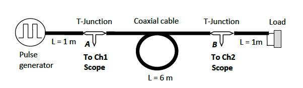
\nopagebreak[4]

\figcap{Figure 1: Q1 experimental setup}

The incident voltage amplitude at A for a matched source ($Z_s = Z_0 = 50\,\Omega$) is $V_\text{inc} = V_s/2 \approx 1\,\text{V}$.

### Q1.1 - Pulse Propagation and Reflection for Each Load

This subsection answers questions 1.1.1, 1.1.3, and 1.1.4 together: for each load (a)-(g) we show the captured waveform at points A and B (Prints 1-7, question 1.1.1), identify the load type from the shape and polarity of the reflected pulse (question 1.1.3), and compare the observed steady-state response with the theoretical prediction (question 1.1.4). The quantitative reflection coefficients (question 1.1.2) are tabulated separately in Q1.1.2.

Ch1 (yellow) = V(A) at T-Junction A; Ch2 (green) = V(B) at T-Junction B. The steady-state load voltage is $V(B) = V_\text{inc}(1 + \Gamma_L)$. Minor reactive-like transients were observed for some loads, attributed to connector parasitics and cable discontinuities; steady-state values were used for all measurements.

#### (a) Short Circuit ($Z_L \approx 0\,\Omega$, $\Gamma = -1$)

Theory: $V(B) \approx 0$, with a brief delta-function spike at each transition; $V(A)$ shows the incident wave followed by a negative-polarity reflected pulse arriving $\Delta t = 2 \times t_d \approx 56\,\text{ns}$ later. Scope signature: an inverted (negative) reflected pulse identifies a load below $Z_0$, here a short.

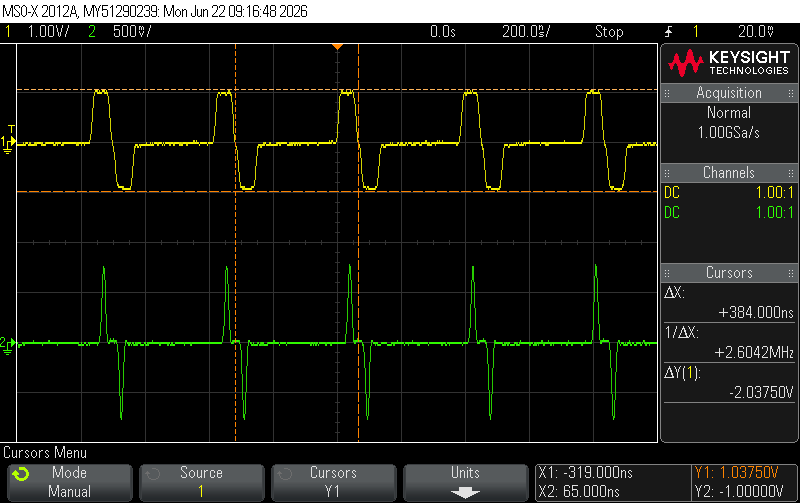
\nopagebreak[4]

\figcap{Figure 2: Print 1 - Short circuit - Ch1 (yellow, V(A)) shows the incident pulse followed by the inverted reflected pulse.}

#### (b) Open Circuit ($Z_L \to \infty$, $\Gamma = +1$)

Theory: $V(B) = 2V_\text{inc} \approx 2\,\text{V}$; the reflected pulse returns to A with the same polarity, appearing as a second consecutive "ON" interval on Ch1. Scope signature: a same-polarity (positive) reflected pulse identifies a load above $Z_0$, here an open.

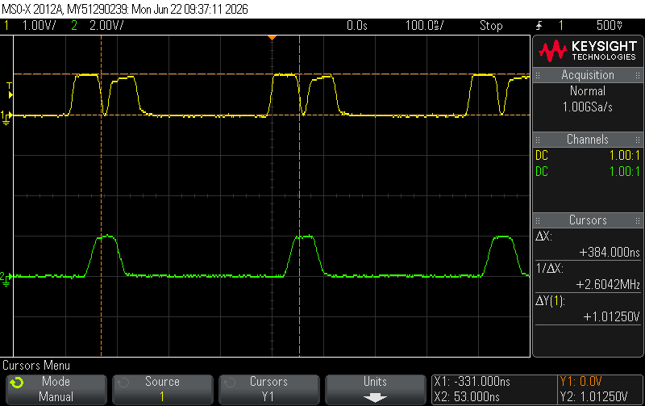
\nopagebreak[4]

\figcap{Figure 3: Print 2 - Open circuit - Ch1 (yellow, V(A)) shows the positive reflected wave arriving as a second ON-state excursion.}

#### (c) $50\,\Omega$ Matched ($\Gamma = 0$)

Theory: no reflection; $V(B) = V(A) = V_\text{inc}$. Scope signature: no reflected pulse at A, and identical pulses at A and B, identify a matched load $Z_L = Z_0$.

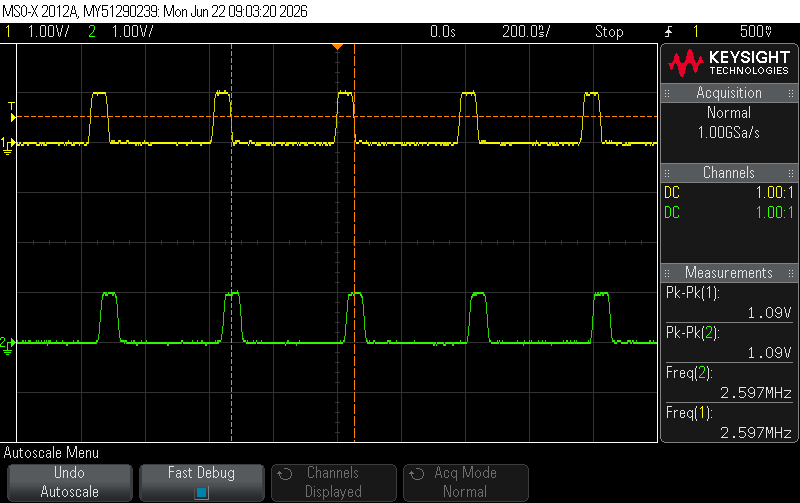
\nopagebreak[4]

\figcap{Figure 4: Print 3 - $50\,\Omega$ matched - both channels identical (Pk-Pk(1) = Pk-Pk(2) = 1.09 V); no reflected wave.}

#### (d) $25\,\Omega$ ($\Gamma = -1/3$)

Theory: $V(B) = V_\text{inc}(1 - 1/3) = 2/3\,\text{V} \approx 0.67\,\text{V}$; the reflected pulse at A is negative. Scope signature: a small negative reflected pulse identifies a resistive load below $Z_0$.

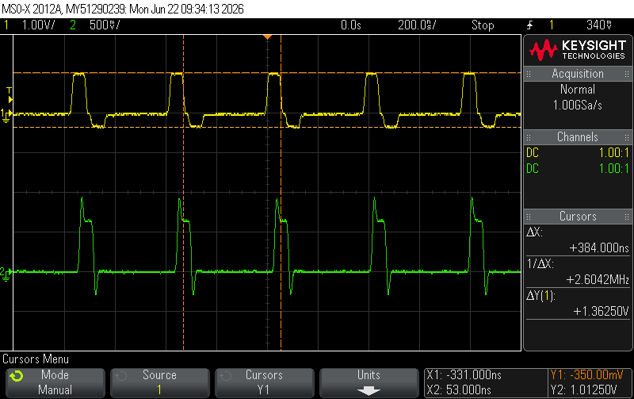
\nopagebreak[4]

\figcap{Figure 5: Print 4 - $25\,\Omega$ - V(A) shows a small negative return during the OFF cycle.}

#### (e) $160\,\Omega$ ($\Gamma = +0.524$)

Theory: $V(B) = V_\text{inc}(1 + 0.524) = 1.524\,\text{V}$. Scope signature: a small positive reflected pulse identifies a resistive load above $Z_0$.

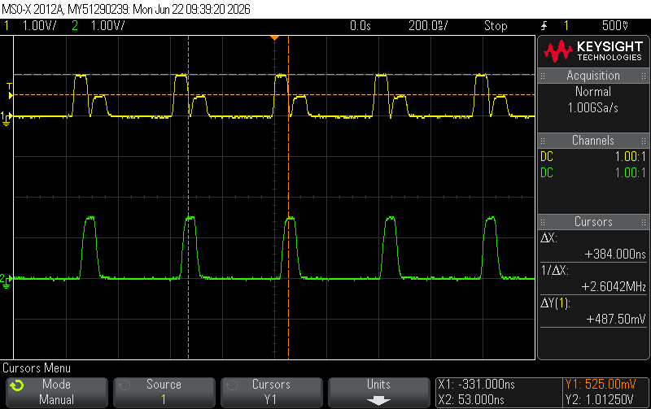
\nopagebreak[4]

\figcap{Figure 6: Print 5 - $160\,\Omega$ - Ch2 (green) steady above 1 V; Ch1 (yellow) shows a positive return during the OFF cycle.}

#### (f) Series R-L ($R = 100\,\Omega$, $L = 1\,\mu\text{H}$)

At $t = 0^+$ the inductor acts as an open circuit ($\Gamma \to +1$, $V(B) \to 2\,\text{V}$). In steady state ($L \to$ wire): $\Gamma_\text{ss} = +1/3$, $V(B) \to 4/3\,\text{V}$. Time constant $\tau = L/(R + Z_0) = 1\,\mu\text{H}/150\,\Omega \approx 6.7\,\text{ns}$. Scope signature: an initial positive overshoot decaying to a positive steady level identifies a series R-L load.

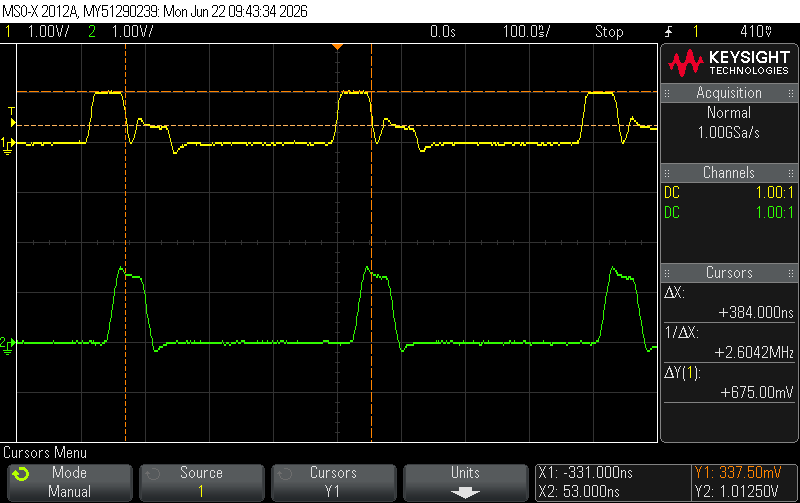
\nopagebreak[4]

\figcap{Figure 7: Print 6 - Series RL - V(B) shows an initial peak followed by exponential decay to $4/3\,\text{V}$, confirming steady-state $\Gamma = +1/3$.}

#### (g) Series R-C ($R = 100\,\Omega$, $C = 1\,\mu\text{F}$)

At $t = 0^+$ the capacitor acts as a short circuit ($\Gamma = +1/3$, $V(B) = 4/3\,\text{V}$). In steady state ($C \to$ open): $\Gamma \to +1$, $V(B) \to 2\,\text{V}$. However, $\tau = (R + Z_0) \times C = 150 \times 10^{-6} = 150\,\mu\text{s} \gg T_\text{pulse} = 200\,\text{ns}$, so the window is too short to observe the charge-up; $V(B)$ remains essentially flat at $\approx 4/3\,\text{V}$. Scope signature: a positive reflected level that stays flat over the pulse identifies a series R-C load with $\tau \gg T_\text{pulse}$.

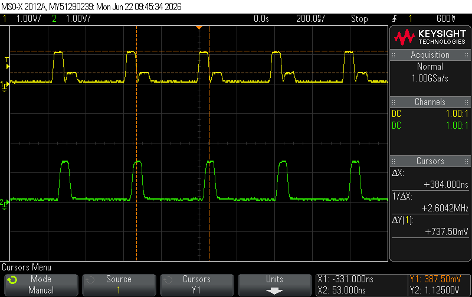
\nopagebreak[4]

\figcap{Figure 8: Print 7 - Series RC - reflected amplitude at A, corresponding to $\Gamma_\text{ss,init} = +1/3$.}

### Q1.1.2 - Measured Reflection Coefficients

Steady-state amplitudes were read from the oscilloscope and $\Gamma_\text{meas} = V_\text{ref}/V_\text{inc}$ computed with sign: negative for $Z_L < Z_0$, positive for $Z_L > Z_0$.

| Load | $V_\text{inc}$ [V] | $|V_\text{ref}|$ [V] | $\Gamma_\text{meas}$ | $\Gamma_\text{theory}$ | $|\%\,\text{err}|$ |
|:-----|:---:|:---:|:---:|:---:|:---:|
| (a) SC | 1.038 | 1.000 | $-0.964$ | $-1.000$ | 3.6% |
| (b) OC | 1.050 | 1.013 | $+0.964$ | $+1.000$ | 3.6% |
| (c) $50\,\Omega$ | 1.090 | 0.000 | $0.000$ | $0.000$ | 0% |
| (d) $25\,\Omega$ | 1.013 | 0.350 | $-0.346$ | $-0.333$ | 3.8% |
| (e) $160\,\Omega$ | 1.013 | 0.525 | $+0.519$ | $+0.524$ | 1.0% |
| (f) $100\,\Omega + 1\,\mu\text{H}$ (steady) | 1.013 | 0.338 | $+0.333$ | $+0.333$ | 0.1% |
| (g) $100\,\Omega + 1\,\mu\text{F}$ (steady) | 1.113 | 0.388 | $+0.348$ | $+0.333$ | 4.5% |

**Discussion:** All results agree well with theory. The SC and OC magnitudes fall slightly below $\pm 1$ due to the non-zero SC resistance and finite OC parasitic capacitance. Both reactive loads (RL, RC) were measured at steady state, confirming $\Gamma_\text{ss} = +1/3$ as expected for a $100\,\Omega$ resistive termination. The RC case shows slightly larger error (4.5%) because $\tau \gg T_\text{pulse}$: the capacitor has not discharged between pulses, slightly raising the average level. All results are consistent with the theory.

### Q1.2 - Waveforms at A and B for Open, Short, and Matched Loads

**(a) Open load (Figure 3, $\Gamma = +1$):** At B the incident and fully reflected waves add in phase, so $V(B)$ rises to about twice the incident level, $V(B) \approx 2V_\text{inc} \approx 2\,\text{V}$. At A the reflected pulse returns with the same (positive) polarity after a round trip $2t_d$, appearing during the OFF interval as a second positive step; A therefore shows the incident pulse followed by a delayed positive return.

**(b) Short load (Figure 2, $\Gamma = -1$):** At B the reflected wave cancels the incident wave, so $V(B) \approx 0$ apart from brief spikes at the switching edges. At A the reflected pulse returns inverted (negative polarity) after $2t_d$, appearing during the OFF interval as a negative dip below the baseline.

**(c) $50\,\Omega$ matched load (Figure 4, $\Gamma = 0$):** There is no reflected wave. $V(A)$ and $V(B)$ are identical clean pulses, separated only by the one-way cable propagation delay $t_d$, and no return pulse appears at A during the OFF interval. This is the signature of a perfectly matched line.

### Q1.3 - Reactive Properties of the Decade Resistance Box

The decade resistance box was used as the termination load (replacing the standard fixed resistor). Although nominally resistive, its wound-resistor construction introduces significant parasitic inductance ($L_\text{par}$), making it behave as a reactive load at the fast pulse rise times of the experiment.

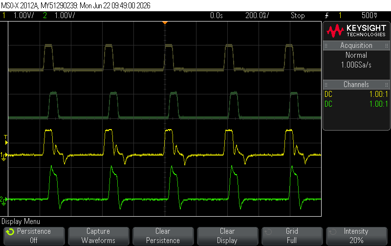
\nopagebreak[4]

\figcap{Figure 9: Print 8 - Decade box vs. Regular load - Upper dark traces: reference with a clean $50\,\Omega$ resistor as the termination. Lower bright traces (yellow = V(A), green = V(B)): decade box used as the load.}

The decade box winding creates a series $R$-$L$ network at each element. When the pulse wavefront arrives at T-Junction B, the inductive parasitics cause transient overshoot and damped oscillations on V(B) before settling to the DC-determined reflection coefficient. The oscillation frequency is $f_\text{osc} = 1/(2\pi\sqrt{L_\text{par}C_\text{line}})$ where $C_\text{line}$ is the coaxial cable capacitance.

This demonstrates that at high frequencies or fast pulse edges, the distributed and parasitic elements of physical components must be considered; the decade box is not a purely resistive load in pulsed applications.

### Q1.4 - Effect of Cable Length on Propagation Delay

The same $50\,\Omega$-terminated setup was measured with the $1\,\text{m}$ stub only (no 6-m coil) and with the full $6\,\text{m}$ cable. The key observable difference is the propagation delay $\Delta t$ between the rising edges of V(A) (Ch1) and V(B) (Ch2).

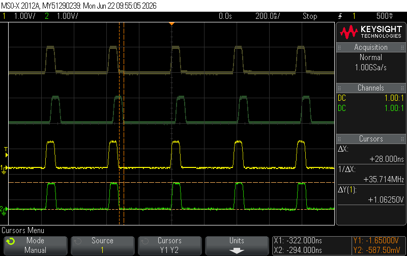
\nopagebreak[4]

\figcap{Figure 10: Print 9 - Propagation delay measurement with $6\,\text{m}$ cable (Top) vs. $1\,\text{m}$ cable (Bottom).}

With the $1\,\text{m}$ cable only, V(A) and V(B) were nearly coincident (delay $<$ 5 ns). With the $6\,\text{m}$ cable, the measured delay is:

$$\Delta t_{6\,\text{m}} = 28\,\text{ns}$$

The characteristic impedance is unaffected by cable length: both cables are $50\,\Omega$ RG58/U and the reflection coefficient is identical for both lengths. The delay difference confirms that the distributed model is correct: information travels at a finite velocity $v_p < c$ along the cable.

**Difference between the signals in Q1.3 and Q1.4:** The two captures isolate two different effects. In Q1.3 both halves of the screen keep the same cable configuration and a matched termination, and only the load is changed (a clean $50\,\Omega$ resistor versus the decade box); the difference seen there is therefore a load-dependent reactive effect, namely the parasitic-inductance overshoot and ringing introduced by the decade box on $V(B)$. In Q1.4 the load is the same clean $50\,\Omega$ termination in both halves, and only the cable length between A and B is changed ($6\,\text{m}$ versus $1\,\text{m}$); the difference there is a pure transmission-line property, namely the propagation delay $\Delta t$ between $V(A)$ and $V(B)$, which shrinks with the shorter cable while the pulse shape stays clean because the load remains matched. In short, Q1.3 varies the load and reveals a reactive (parasitic) effect, whereas Q1.4 varies the line length and reveals a propagation-delay effect.

### Q1.5 - Phase Velocity and Characteristic Impedance

**Phase velocity from $\Delta t$:**

$$v_p = \frac{L}{\Delta t} = \frac{6\,\text{m}}{28\,\text{ns}} = 2.14 \times 10^8\,\text{m/s} = 0.714\,c$$

$$v_{p,\text{theory}} = \frac{c}{\sqrt{\varepsilon_r}} = \frac{3\times10^8}{\sqrt{2.2}} = 2.02\times10^8\,\text{m/s} = 0.674\,c$$

$$\%\,\text{error} = \left|\frac{0.714 - 0.674}{0.674}\right| \times 100\% = 5.9\%$$

**Characteristic impedance via voltage divider:** The generator is rated at $V_\text{in} = 1\,\text{V}$ into a $50\,\Omega$ matched load, so its open-circuit (Thevenin) voltage is $V_\text{oc} = 2\,\text{V}$. With source impedance $Z_s = 50\,\Omega$, node A satisfies:

$$V_A = V_\text{oc} \cdot \frac{Z_0}{Z_s + Z_0} \implies Z_0 = Z_s \cdot \frac{V_A}{V_\text{oc} - V_A}$$

In practice the measured amplitude at A with the $50\,\Omega$ load was $V_A = 1.0215\,\text{V}$ (not the nominal $1\,\text{V}$), reflecting a cable characteristic impedance slightly above $50\,\Omega$:

$$Z_0 = 50 \cdot \frac{1.0215}{2.000 - 1.0215} = 50 \cdot \frac{1.0215}{0.9785} = 52.2\,\Omega$$

The measured $Z_0 = 52.2\,\Omega$ is within the typical $\pm5\%$ tolerance of RG58/U cable. The result is consistent with a near-zero reflection coefficient at the $50\,\Omega$ load.

The 5.9% over-estimate of $v_p$ is consistent with the RG58/U polyethylene dielectric having an effective $\varepsilon_r$ slightly below the nominal 2.2, which is a minimum value in the datasheet.

\newpage

## Q2 - Resistive Power Splitter

In this first measurement only one of the two output branches is physically built. The splitter network uses $R_1 = 16\,\Omega$ (input series arm) and $R_3 = 16\,\Omega$ (series arm of the real branch, loaded by $50\,\Omega$). The second branch is not built: it is emulated by a single mockup resistor $R_2 = 68\,\Omega$, which stands in for that branch's series arm plus its load ($16 + 50 \approx 68\,\Omega$). $R_2$ is therefore not a shunt element of the splitter network; it is a lumped stand-in for the whole second branch. Circuit is shown in Figure 11.

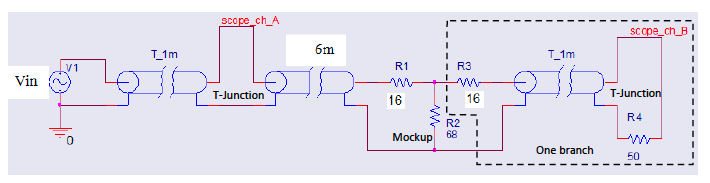
\nopagebreak[4]

\figcap{Figure 11: Power splitter experimental circuit.}

**Input impedance:** Seen from the source, $R_1$ is in series with the parallel combination of the real loaded branch ($R_\text{branch} = R_3 + R_\text{load} = 16 + 50 = 66\,\Omega$) and the mockup branch $R_2 = 68\,\Omega$:

$$Z_\text{in} = R_1 + (R_\text{branch} \| R_2) = 16 + \frac{66 \times 68}{66 + 68} = 16 + 33.5 = 49.5\,\Omega \approx 50\,\Omega$$

### Q2.1 - Reflection Coefficient

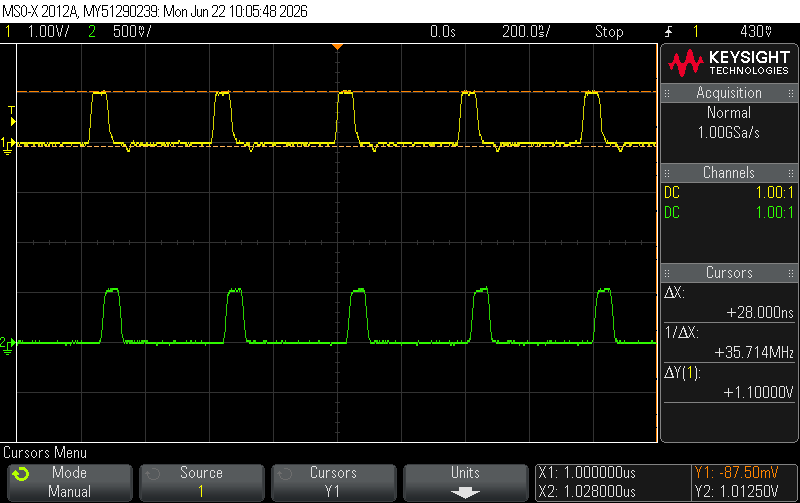
\nopagebreak[4]

\figcap{Figure 12: Print 10 - Power splitter reflection measurement}

| Load | $V_\text{inc}$ [V] | $V_\text{ref}$ [V] | $\Gamma_\text{meas}$ | $\Gamma_\text{theory}$ |
|:-----|:---:|:---:|:---:|:---:|
| Splitter ($Z_\text{in} = 50\,\Omega$) | 1.063 | 0.088 | $+0.082$ | $\approx 0$ |

The small $\Gamma = +0.082$ (vs. ideal 0) is attributable to reactive parasitics from BNC connectors and T-junction discontinuities, and to component tolerances. The line is considered matched.

### Q2.2 - Power Delivered to the Load

Assuming $R_\text{in} \approx 50\,\Omega$ (confirmed Q2.1), peak voltage measured from the scope, power $P = V_\text{peak}^2/(2R)$:

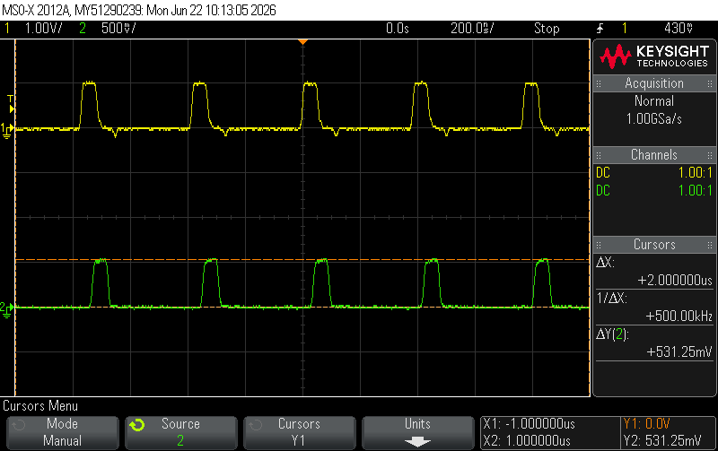
\nopagebreak[4]

\figcap{Figure 13: Power splitter voltage measurement}

$$P_\text{in} = \frac{(1.013)^2}{2 \times 50} = 10.25\,\text{mW}$$

$$P_\text{load} = \frac{(0.531)^2}{2 \times 50} = 2.82\,\text{mW}$$

| Point | $V_\text{peak}$ [V] | $R\,[\Omega]$ | $P = V^2/2R$ [mW] | $P_\text{theory}$ [mW] | $|\%\,\text{err}|$ |
|:------|:---:|:---:|:---:|:---:|:---:|
| Input (A) | 1.013 | 50 | 10.25 | 10.00 | 2.5% |
| Load (B) | 0.531 | 50 | 2.82 | 2.45 | 15.1% |

### Q2.3 - Is This an Ideal Power Splitter?

**No.** The circuit achieves two properties of an ideal equal-split divider (input matching and symmetric power division) but fails on two fundamental criteria:

**1. Significant insertion loss.** An ideal lossless 2-way splitter delivers $-3\,\text{dB}$ (50%) of input power to each output port. Here, $P_\text{in} = 10.25\,\text{mW}$ but each branch receives only $P_B = 2.82\,\text{mW}$ (27.5%), with the remaining $\approx 4.61\,\text{mW}$ (45%) dissipated in $R_1$, $R_2$, $R_3$. The resistive network is inherently lossy.

**2. No port isolation.** In an ideal splitter (e.g., the Wilkinson divider), the two output ports are mutually isolated, so a signal injected at one output does not appear at the other. In this purely resistive network the two output branches meet at the common splitter node through their series arms, with no isolating element between them, so the isolation is zero. (In the present single-branch measurement the second port is only the $R_2 = 68\,\Omega$ mockup, but the absence of isolation is a property of the resistive topology itself, not of the mockup.)

**What it does satisfy:**

- Input matching: $Z_\text{in} = 49.5\,\Omega \approx 50\,\Omega$ ($\Gamma \approx 0$, confirmed Q2.1).
- Equal split: circuit symmetry ensures both branches deliver identical power.

In conclusion, this is a **resistive voltage divider used as a power divider**, not a true power splitter. It trades insertion loss and port isolation for simplicity, broadband operation (no reactive elements), and exact input impedance matching.

### Q2.4.1 - Equal Power on Both Branches

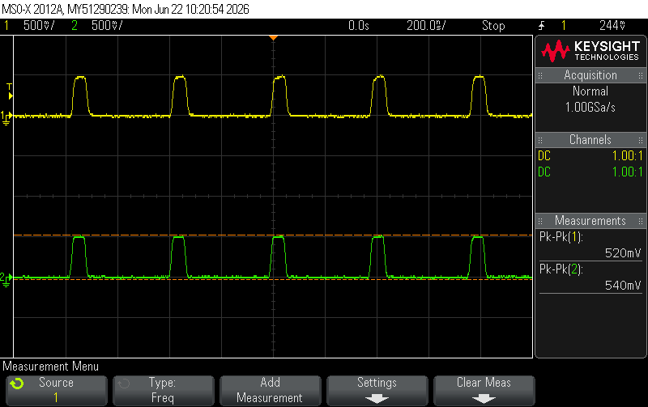
\nopagebreak[4]

\figcap{Figure 14: Print 11 - Q2.4.1 - Two branch measurement.}

The power is equal on both branches since: (a) the circuit is symmetric, (b) the voltage at each output equals $V_\text{in} \times R_4/(R_3 + R_4)$, identical for both branches. With the mockup now replaced by a real second branch, both branches are identical $66\,\Omega$ arms, so the total input impedance is $R_1 + 66\|66 = 16 + 33 = 49\,\Omega \approx 50\,\Omega$, confirming the design.

Yellow trace: $V(\text{new branch})$; green trace: $V(B)$. Both channels show identical amplitude, confirming equal power split.

### Q2.4.2 - Power at Each Branch

From the Q2.4.1 oscilloscope (identical amplitudes on both channels), and using the measured $V_A = 1.013\,\text{V}$ from Q2.2:

By symmetry $V(\text{new branch}) = V(B)$; each branch power:

$$P_\text{each} = \frac{V_B^2}{2 R} = \frac{(0.531)^2}{2 \times 50} = 2.82\,\text{mW}$$

**Total power balance:**

| Port | $V_\text{peak}$ [V] | $P$ [mW] |
|:---|:---:|:---:|
| Input (A) | 1.013 | 10.25 |
| Branch B | 0.531 | 2.82 |
| New branch | 0.531 | 2.82 |
| **Total to loads** | n/a | **5.64** |
| Dissipated in resistors | n/a | 4.61 |

The two output branches together consume 5.64 mW (55% of input power); the remaining 4.61 mW is dissipated in the splitter resistors. This is consistent with the resistive splitter design: equal split but with inherent resistive loss. Each real branch carries 2.82 mW, identical to the single branch measured with the $68\,\Omega$ mockup in Q2.2, and the reflection is unchanged from Q2.1; this confirms the mockup faithfully represented the second branch.

\newpage

## Q3 - T-Type Attenuator ($-3\,\text{dB}$, $Z_0 = 50\,\Omega$)

The T-attenuator was constructed with $R_1 = 10\,\Omega$ (series arms) and $R_2 = 150\,\Omega$ (shunt). Circuit with transmission line connections is shown in Figure 15.

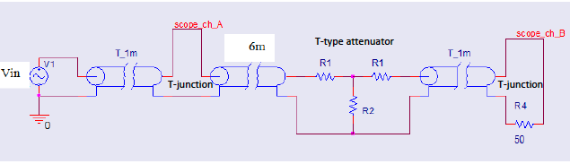
\nopagebreak[4]

\figcap{Figure 15: T-attenuator experimental circuit - $R_1 = 10\,\Omega$ (each series arm), $R_2 = 150\,\Omega$ (shunt), $T_\text{1m}$ cables with T-junctions at each port, $R_4 = 50\,\Omega$ load.}

**Theoretical analysis with $R_1 = 10\,\Omega$, $R_2 = 150\,\Omega$, $Z_L = 50\,\Omega$:**

$$Z_\text{in} = R_1 + R_2\|(R_1 + Z_L) = 10 + \frac{150 \times 60}{210} = 10 + 42.9 = 52.9\,\Omega$$

$$\Gamma_\text{theory} = \frac{Z_\text{in} - Z_0}{Z_\text{in} + Z_0} = \frac{52.9 - 50}{52.9 + 50} = \frac{2.9}{102.9} = +0.028 \approx 0$$

Voltage transmission: $V_\text{load}/V_A = 0.694$ (theoretical), i.e., $-3.17\,\text{dB}$.

### Q3.1 - Reflection Coefficient

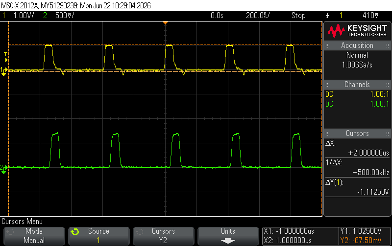
\nopagebreak[4]

\figcap{Figure 16: Print 12 - T-attenuator reflection measurement - V(A) (yellow) and V(B) (green) with small positive reflected component on V(A); near-zero reflection confirms matched input impedance.}

| Load | $V_\text{inc}$ [V] | $V_\text{ref}$ [V] | $\Gamma_\text{meas}$ | $\Gamma_\text{theory}$ |
|:-----|:---:|:---:|:---:|:---:|
| T-attenuator | 1.025 | 0.088 | $+0.085$ | $+0.028$ |

The measured $\Gamma = +0.085$ is slightly above the theoretical $+0.028$, which is attributed to parasitic coupling in the T-junction connectors and the actual component tolerances. Since $\Gamma \approx 0$, the input impedance $Z_\text{in} \approx 50\,\Omega$ is confirmed and the line is treated as matched.

### Q3.2 - Power Consumption

With $R_\text{in} \approx 50\,\Omega$ (confirmed Q3.1), $P = V_\text{peak}^2/(2R)$:

$$P_\text{in} = \frac{(1.013)^2}{100} = 10.25\,\text{mW}, \qquad P_\text{load} = \frac{(0.700)^2}{100} = 4.90\,\text{mW}$$

| Point | $V_\text{peak}$ [V] | $R\,[\Omega]$ | $P$ [mW] | $P_\text{theory}$ [mW] | $|\%\,\text{err}|$ |
|:------|:---:|:---:|:---:|:---:|:---:|
| Input (A) | 1.013 | 50 | 10.25 | 10.00 | 2.5% |
| Load (B) | 0.700 | 50 | 4.90 | 5.00 | 2.0% |

$$\text{Attenuation} = \frac{P_\text{load}}{P_\text{in}} = \frac{4.90}{10.25} = 0.478 \approx 0.5 = -3.2\,\text{dB}$$

Excellent agreement with the $-3\,\text{dB}$ design target (2.0% error on power). This confirms the preliminary analysis (Q1.9), which predicted $P_\text{load}/P_\text{in} = 0.5$ for the T-attenuator.

### Q3.3 - Resistor Values for 6 dB Attenuation

For a symmetric T-attenuator matched to $Z_0 = 50\,\Omega$, the series arms $R_1$ and the shunt arm $R_2$ are set by the voltage attenuation ratio $k = V_\text{in}/V_\text{out} = 10^{A_\text{dB}/20}$:

$$R_1 = Z_0\,\frac{k-1}{k+1}, \qquad R_2 = Z_0\,\frac{2k}{k^2 - 1}$$

For $A_\text{dB} = 6\,\text{dB}$ the voltage ratio is $k = 10^{6/20} = 1.995 \approx 2$ (a power ratio of $4$). Substituting $k = 2$ and $Z_0 = 50\,\Omega$:

$$R_1 = 50 \cdot \frac{2 - 1}{2 + 1} = \frac{50}{3} \approx 16.7\,\Omega$$

$$R_2 = 50 \cdot \frac{2 \times 2}{2^2 - 1} = 50 \cdot \frac{4}{3} \approx 66.7\,\Omega$$

Check: $Z_\text{in} = R_1 + R_2\|(R_1 + Z_L) = 16.7 + 66.7\|66.7 = 16.7 + 33.3 = 50\,\Omega$, so the network stays matched, and the matched voltage transfer is $V_\text{out}/V_\text{in} = 1/k = 0.5$, i.e. exactly $-6\,\text{dB}$. Compared with the $-3\,\text{dB}$ design ($R_1 = 8.58\,\Omega$, $R_2 = 141.4\,\Omega$), a larger attenuation requires larger series arms and a smaller shunt arm.

### Q3.4 - Input Impedance at the Cable Input: Experiment vs. Theory

**Setup:** signal generator with $Z_s = 50\,\Omega$ output impedance, $V_\text{pp} = 1\,\text{V}$. The $6\,\text{m}$ cable is matched ($Z_\text{cable} = Z_0 = 50\,\Omega$), so the source sees the T-attenuator input impedance directly.

**Theoretical (from the resistor network):** using the built values $R_1 = 10\,\Omega$, $R_2 = 150\,\Omega$, $Z_L = 50\,\Omega$, as computed at the start of Q3,

$$R_\text{in,theory} = R_1 + R_2\|(R_1 + Z_L) = 10 + \frac{150 \times 60}{210} = 10 + 42.9 = 52.9\,\Omega$$

**Experimental (from power balance):** the load power and, using the measured $-3\,\text{dB}$ ($P_\text{load} = P_\text{in}/2$), the input power are

$$P_\text{load} = \frac{V_\text{load}^2}{2R_\text{load}} = \frac{(0.700)^2}{100} = 4.90\,\text{mW}, \qquad P_\text{in} = 2 P_\text{load} = 9.80\,\text{mW}$$

so the measured input resistance is

$$R_\text{in,meas} = \frac{V_A^2}{2 P_\text{in}} = \frac{(1.025)^2}{2 \times 9.80 \times 10^{-3}} = \frac{1.051}{0.0196} \approx 53.6\,\Omega$$

**Comparison:** the measured $R_\text{in,meas} = 53.6\,\Omega$ agrees with the theoretical $R_\text{in,theory} = 52.9\,\Omega$ to within

$$\%\,\text{error} = \left|\frac{53.6 - 52.9}{52.9}\right| \times 100\% = 1.3\%$$

confirming $R_\text{in} \approx Z_0 = 50\,\Omega$ and a matched input. The small offset above $50\,\Omega$ is due to the slightly non-standard component values used. That is, $R_1 = 10\,\Omega$, $R_2 = 150\,\Omega$, instead of the optimal values $8.58\,\Omega$, $141.4\,\Omega$, which we found in the preliminary report (Q1.9) to be ideal for $-3\,\text{dB}$ attenuation.

\newpage

## Q4 - LC $\pi$-Type Low-Pass Filter

The filter uses $L_3 = 1\,\mu\text{H}$, $C_6 = C_7 = 821\,\text{pF}$, $R_7 = 50\,\Omega$, with $T_\text{1m}$ transmission lines at both ports. The design value of the capacitors is $815\,\text{pF}$; we used $821\,\text{pF}$ because that was the closest value available in the lab. Circuit is shown in Figure 17.

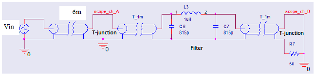
\nopagebreak[4]

\figcap{Figure 17: LC $\pi$ low-pass filter circuit - inside the transmission line}

**Theoretical resonant frequency with $821\,\text{pF}$:**

$$f_0 = \frac{1}{2\pi\sqrt{LC}} = \frac{1}{2\pi\sqrt{10^{-6} \times 821 \times 10^{-12}}} \approx 5.56\,\text{MHz}$$

**Theoretical $-3\,\text{dB}$ frequency for $Q = 1.43$:**

For a 2nd-order filter $H(s) = \omega_0^2/(s^2 + s\omega_0/Q + \omega_0^2)$, the $-3\,\text{dB}$ bandwidth satisfies:

$$x^2 + x\!\left(\frac{1}{Q^2} - 2\right) - 1 = 0, \quad x = \left(\frac{\omega_{-3\text{dB}}}{\omega_0}\right)^2 \Rightarrow \frac{f_{-3\text{dB}}}{f_0} \approx 1.42$$

$$f_{-3\text{dB},\text{theory}} = 1.42 \times 5.56 \approx 7.9\,\text{MHz}$$

As a qualitative overview before the detailed point-by-point sweep, Figure 18 shows a continuous wideband logarithmic frequency sweep of the filter across the same band. This capture is not required by the report; it was taken only to visualize the expected behaviour (pass-band, cutoff, and stop-band).

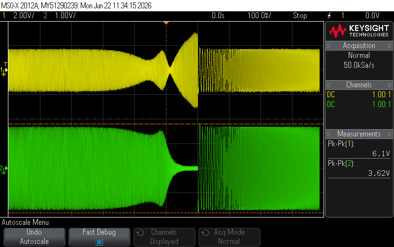{width=62%}
\nopagebreak[4]

\figcap{Figure 18: Wideband oscilloscope sweep 0.1-20 MHz. Upper envelope (yellow, Ch1): $V_A$ at the input T-junction, showing the frequency-dependent reflection/absorption behavior. Lower envelope (green, Ch2): filtered output $V_\text{out}$, showing the filter pass-band ($\sim 0$--$8\,\text{MHz}$) and deep stop-band attenuation above.}

\newpage

### Q4.1 - Manual Frequency Sweep

#### Q4.1.1 - Gain vs. Frequency (Logarithmic Scale)

$V_\text{in} = 3.2\,\text{Vpp}$ held constant. Gain $= V_\text{out}/V_\text{in}$. As noted above, $C = 821\,\text{pF}$ was used (the closest available value to the designed $815\,\text{pF}$).

| $f$ [MHz] | $V_A$ [Vpp] | $V_\text{out}$ [Vpp] | Gain [dB] |
|:---:|:---:|:---:|:---:|
| 0.1  | 3.42 | 3.42 | +0.58 |
| 1    | 3.22 | 3.34 | +0.37 |
| 2    | 2.65 | 3.10 | -0.28 |
| 3    | 2.01 | 2.89 | -0.88 |
| 4    | 1.65 | 2.77 | -1.25 |
| 5    | 1.87 | 2.81 | -1.13 |
| 5.6  | 2.29 | 2.89 | -0.88 |
| 6    | 2.61 | 2.97 | -0.65 |
| 7    | 3.06 | 2.89 | -0.88 |
| 8    | 2.53 | 2.57 | -1.90 |
| **8.3**  | **2.13** | **2.25** | **-3.06** |
| 8.8  | 1.37 | 1.81 | -4.95 |
| 9    | 1.09 | 1.65 | -5.75 |
| 10   | 0.50 | 1.05 | -9.68 |
| 11   | 1.33 | 0.68 | -13.45 |
| 20   | 5.00 | 0.119 | -28.59 |
| 30   | n/a | 0.112 | -29.04 |

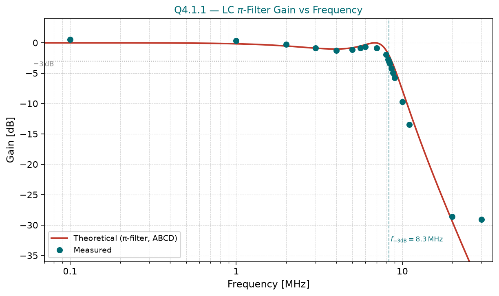
\nopagebreak[4]

\figcap{Figure 19: Q4.1.1 - filter gain vs frequency (0.1--30 MHz). Measured data (teal circles) compared to theoretical ABCD-matrix response (red curve). The $-3\,\text{dB}$ crossover is at $f_{-3\text{dB}} = 8.3\,\text{MHz}$; resonant peak near $f_0 = 5.56\,\text{MHz}$; steep roll-off in stop band.}

**Key observations:**

- **Pass-band** ($f < 4\,\text{MHz}$): Gain $\approx 0\,\text{dB}$, filter transparent.
- **Resonant gain peak** at $5.6$--$6\,\text{MHz}$: gain recovers to $\approx -0.65\,\text{dB}$ after the local minimum at $\sim 4\,\text{MHz}$, consistent with underdamped 2nd-order response ($Q = 1.43 > 1/\sqrt{2}$).
- **Measured $f_{-3\text{dB}} = 8.3\,\text{MHz}$** vs. theoretical $7.9\,\text{MHz}$, a 5.1% error.
- **Stop band**: $-9.7\,\text{dB}$ at $10\,\text{MHz}$, $-13.5\,\text{dB}$ at $11\,\text{MHz}$, $-28.6\,\text{dB}$ at $20\,\text{MHz}$, $-29.0\,\text{dB}$ at $30\,\text{MHz}$.

The small increase in $C$ from $815\,\text{pF}$ to $821\,\text{pF}$ (0.7%) has negligible effect on $f_0$. The measured $f_{-3\text{dB}}$ is 5.1% higher than theory, likely due to parasitic inductance and capacitance from the filter PCB and connectors slightly modifying the effective $Q$.

#### Q4.1.2 - Reflection Coefficient vs. Frequency (Logarithmic Scale)

The reflection coefficient is computed from the measured $V_A$ using:

$$\Gamma = \frac{V_A}{V_\text{in}} - 1 = \frac{V_A}{3.2} - 1$$

(valid because $V_A = V_\text{inc}(1 + \Gamma)$ and $V_\text{inc} = V_\text{in}$ is the incident voltage at node A with the matched source.)

| $f$ [MHz] | $V_A$ [Vpp] | $\Gamma$ | Return Loss [dB] |
|:---:|:---:|:---:|:---:|
| 0.1  | 3.42 | $+0.069$ | 23.2 |
| 1    | 3.22 | $+0.006$ | 44.1 |
| 2    | 2.65 | $-0.172$ | 15.3 |
| 3    | 2.01 | $-0.372$ | 8.6 |
| 4    | 1.65 | $-0.484$ | 6.3 |
| 5    | 1.87 | $-0.416$ | 7.6 |
| 7    | 3.06 | $-0.044$ | 27.2 |
| 9    | 1.09 | $-0.659$ | 3.6 |
| **10**   | **0.50** | **$-0.844$** | 1.5 |
| 11   | 1.33 | $-0.584$ | 4.7 |
| **20**   | **5.00** | **$+0.563$** | 5.0 |
| **30**   | **5.90** | **$+0.844$** | 1.5 |

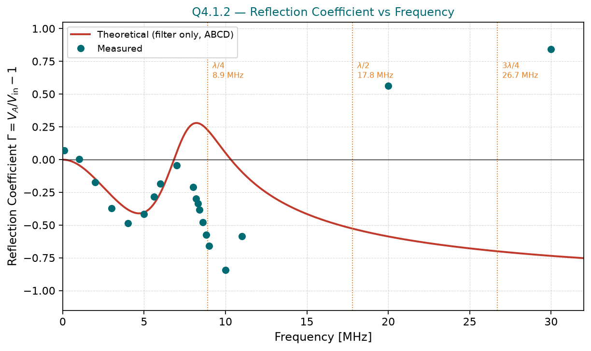
\nopagebreak[4]

\figcap{Figure 20: Q4.1.2 - reflection coefficient $\Gamma$ vs. frequency (0.1--30 MHz). Red curve: filter-only ABCD theory (monotonically negative, no cable effects). Teal circles: measured data. The sign oscillations in the measured curve are caused by cable standing-wave resonances at $f_{\lambda/4}=8.9\,\text{MHz}$, $f_{\lambda/2}=17.8\,\text{MHz}$, and $3\lambda/4=26.7\,\text{MHz}$, not captured by the filter-only theory.}

### Q4.2 - Frequency Dependence of the Reflection Coefficient (Comparison with Theory)

The measured $\Gamma(f)$ is compared with the filter-only ABCD theory (red curve, Figure 20). The two agree in the pass-band but diverge increasingly in the stop-band. Two effects combine.

**Filter mismatch sets the magnitude of $\Gamma$.** In the pass-band ($f \ll f_c$) the filter is matched, $Z_\text{in} \approx 50\,\Omega$, so $\Gamma \approx 0$ (return loss $> 20\,\text{dB}$ at $0.1$ to $1\,\text{MHz}$). As the frequency enters the stop-band the filter becomes strongly reactive (the shunt capacitor $C_6$ progressively bypasses the input), reflecting most of the incident power, so $|\Gamma|$ grows toward $1$. This growth of the magnitude is the trend the filter-only theory reproduces.

**The 6 m cable rotates the phase of $\Gamma$, so its apparent sign oscillates.** A lossless line leaves the magnitude of the reflection coefficient unchanged but rotates its phase,

$$\Gamma_A = \Gamma_\text{filter}\,e^{-2j\beta L}, \qquad \beta L = \frac{2\pi L}{v_p}\,f,$$

so the electrical length $\beta L$ grows with frequency. We infer $\Gamma$ from the measured amplitude through $\Gamma = V_A/V_\text{in} - 1 = |1 + \Gamma_A| - 1$, which is negative when the rotated $\Gamma_A$ points toward $-1$ (node A near a voltage minimum, $V_A < V_\text{in}$) and positive when it points toward $+1$ (node A near a voltage maximum, $V_A > V_\text{in}$). The phase $2\beta L$ advances by $180^\circ$ each time the cable grows by a quarter wavelength, i.e. every

$$\Delta f = \frac{v_p}{4L} = \frac{2.14 \times 10^8}{4 \times 6} \approx 8.9\,\text{MHz},$$

so the apparent sign of $\Gamma$ reverses roughly every $9\,\text{MHz}$. The standing-wave landmarks on the $6\,\text{m}$ cable are thus $f_{\lambda/4} \approx 8.9\,\text{MHz}$, $f_{\lambda/2} \approx 17.8\,\text{MHz}$, and $f_{3\lambda/4} \approx 26.7\,\text{MHz}$.

This is exactly the measured behaviour: a deep negative excursion appears near the first resonance ($V_A = 0.50\,\text{V}$, $\Gamma = -0.844$ at $10\,\text{MHz} \approx f_{\lambda/4}$, node A near a voltage minimum), followed by positive excursions at higher frequencies, where the phase has rotated and the mismatch envelope is larger ($V_A = 5.0\,\text{V}$, $\Gamma = +0.563$ at $20\,\text{MHz}$; $V_A = 5.9\,\text{V}$, $\Gamma = +0.844$ at $30\,\text{MHz}$, both with $V_A > V_\text{in} = 3.2\,\text{V}$, node A near a voltage maximum).

**Comparison with theory.** The filter-only ABCD model contains no cable, so it predicts a smooth, monotonic $\Gamma$ with no sign reversals. The oscillating sign in the measurement is therefore a standing-wave artifact of the $6\,\text{m}$ transmission line in the measurement setup, not a property of the filter itself. The fact that the excursions line up with the cable's $\lambda/4$, $\lambda/2$, and $3\lambda/4$ resonances confirms their cable origin.
