---
header-includes:
- \usepackage{xcolor}
- \definecolor{labteal}{HTML}{006b73}
- \newcommand{\figcap}[1]{\begin{center}\textcolor{labteal}{\textit{#1}}\end{center}}
- \makeatletter
- \renewcommand{\subsubsection}{\@startsection{subsubsection}{3}{2em}{-3.25ex plus -1ex minus -.2ex}{1.5ex plus .2ex}{\normalfont\normalsize\bfseries}}
- \makeatother
---

# Lab 7: Operational Amplifiers (Preliminary Report)

**Students:** Shai Livshits · 208632216 &nbsp;|&nbsp; Dan Masad · 206505307
**Date:** June 26, 2026
**Course:** Lab A Electronics, TAU Faculty of Engineering, Semester B 2025-2026

---

\newpage

## 1. Op-Amp Properties Table (Datasheet Summary)

| Parameter | TL071M | TL061M | LM741 |
|:---|:---:|:---:|:---:|
| Input offset voltage $V_{io}$ | 3 mV (typ) | 3 mV (typ) | 1 mV (typ), 6 mV (max) |
| Large-signal voltage gain $A_{OL}$ | 200 V/mV (typ) | 200 V/mV (typ) | 200 V/mV (typ) |
| CMRR | 86 dB (typ) | 80 dB (typ) | 90 dB (typ) |
| Slew rate $SR$ (unity-gain) | 13 V/μs | 3.5 V/μs | 0.5 V/μs |
| Unity-gain bandwidth $f_t$ / GBW | 3 MHz | 1 MHz | 1 MHz |

\newpage

## 2. Explanation of Op-Amp Properties

### 2.1 Definition of Each Property

- **Input offset voltage $V_{io}$:** The differential DC voltage that must be applied between the inputs to force $V_{out}=0$; arises from transistor mismatches in the input stage.
- **Large-signal voltage gain $A_{OL}$:** Ratio of output to differential input voltage in open loop, measured at DC with a large (but unsaturated) output swing.
- **CMRR:** Ratio of differential gain to common-mode gain; indicates the op-amp's ability to reject signals common to both inputs. A high CMRR means the output responds only to the differential signal.
- **Slew rate $SR$:** Maximum rate of change of the output voltage ($\mathrm{d}V_{out}/\mathrm{d}t\big|_{\max}$). Caused by a current-limited internal capacitor that must charge/discharge at a finite rate.
- **Unity-gain bandwidth / GBW:** $f_t$ is the frequency at which open-loop gain falls to 1 (0 dB). GBW is the product of closed-loop gain and 3 dB bandwidth; in a single-pole model, $f_t = \mathrm{GBW}$.

### 2.2 Differences in Bandwidth-Related Specifications

All three quantities ($f_t$, GBW, $f_{-3\mathrm{dB}}$) describe frequency limitations but represent different things:

- $f_t$ (unity-gain bandwidth) is the frequency where $|A_{OL}|=1$; it is an **open-loop** property.
- GBW (gain-bandwidth product) is $|A_{CL}| \times f_{-3\mathrm{dB}}$ for the **closed-loop** circuit; for a single-pole op-amp, GBW $= f_t$.
- $f_{-3\mathrm{dB}}$ is the **closed-loop** bandwidth at a specific gain; it depends on the circuit.

The datasheets may label these differently (e.g. TL071/TL061 quote "unity-gain bandwidth" directly; LM741 quotes a "gain-bandwidth product"). In the single-pole model they are identical, but multi-pole op-amps can have $f_t < \mathrm{GBW}$.

\newpage

## 3. Voltage Definitions

We use our assigned numerical values $A = \dfrac{\mathrm{DEF}}{100} = \dfrac{307}{100} = 3.07\,\mathrm{V}$ and $B = 10\,\mathrm{V}$ (both positive), with $V(t) = A\sin(\omega t)$ unless noted.

### 3.1 $V(t) = A\sin(\omega t)$

| Quantity | Expression | Value ($A=3.07\,\mathrm{V}$) |
|:---|:---|:---:|
| $V_\text{amplitude}$ | $A$ | $3.07\,\mathrm{V}$ |
| $V_\text{max}$ | $A$ | $3.07\,\mathrm{V}$ |
| $V_\text{mean}$ | $0$ | $0\,\mathrm{V}$ |
| $V_{pp}$ | $2A$ | $6.14\,\mathrm{V}$ |
| $V_\text{RMS}$ | $\dfrac{A}{\sqrt{2}}=\sqrt{\frac{1}{T}\int_0^T A^2\sin^2(\omega t)\,\mathrm{d}t}$ | $2.171\,\mathrm{V}$ |

### 3.2 $V(t) = A\sin(\omega t) + B$, $B > 0$

| Quantity | Expression | Value ($A=3.07\,\mathrm{V}$, $B=10\,\mathrm{V}$) |
|:---|:---|:---:|
| $V_\text{amplitude}$ | $A$ | $3.07\,\mathrm{V}$ |
| $V_\text{max}$ | $A + B$ | $13.07\,\mathrm{V}$ |
| $V_\text{mean}$ | $B$ | $10\,\mathrm{V}$ |
| $V_{pp}$ | $2A$ | $6.14\,\mathrm{V}$ |
| $V_\text{RMS}$ | $\sqrt{\dfrac{A^2}{2} + B^2}$ | $10.233\,\mathrm{V}$ |

### 3.3 $V(t) = A\sin(\omega t) - B$, $B > 0$

| Quantity | Expression | Value ($A=3.07\,\mathrm{V}$, $B=10\,\mathrm{V}$) |
|:---|:---|:---:|
| $V_\text{amplitude}$ | $A$ | $3.07\,\mathrm{V}$ |
| $V_\text{max}$ | $A - B$ | $-6.93\,\mathrm{V}$ |
| $V_\text{mean}$ | $-B$ | $-10\,\mathrm{V}$ |
| $V_{pp}$ | $2A$ | $6.14\,\mathrm{V}$ |
| $V_\text{RMS}$ | $\sqrt{\dfrac{A^2}{2} + B^2}$ | $10.233\,\mathrm{V}$ |

Note: $V_\text{RMS}$ is always non-negative ($V_\text{RMS} \geq 0$) even when $V_\text{mean} < 0$, because it is the root of the mean-square. The sign of $V_\text{mean}$ does not affect $V_\text{RMS}$, both Q3.2 and Q3.3 give the same $V_\text{RMS}=10.233\,\mathrm{V}$.

\newpage

## 4. Input Offset Voltage

### 4.1 Non-Ideal Model of Figure 2 (Assume $V_{out} = 216\,\mathrm{mV}$)

The input offset voltage $V_{io}$ is the same quantity the datasheets label $V_{os}$, we use the course notation $V_{io}$. If we assume the op-amp is ideal in the offset sense ($V_{io}=0$), the output would be $V_{out}=0$; a real op-amp has $V_{io}\neq 0$ and therefore a non-zero output. The non-ideal op-amp is modelled by inserting a DC source $V_{io}$ in series with the non-inverting ($+$) input of an otherwise ideal op-amp.

We are told to assume the (measured) output is $V_{out} = \mathrm{ABC}\,\mathrm{mV} = 216\,\mathrm{mV}$. In the redrawn circuit, $V_{io}$ sits in series with the $+$ terminal and is amplified by the non-inverting gain to produce the observed $V_{out}$.

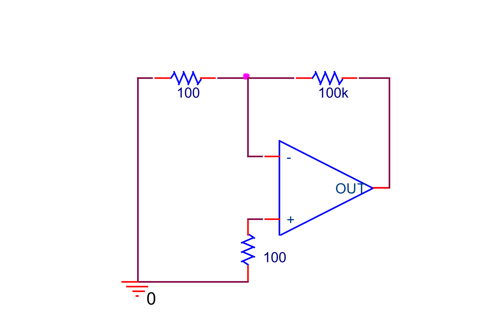{width=2.2in}
\nopagebreak[4]

\figcap{Figure 1 - Figure 2: Inverting amplifier used to observe input offset voltage ($R_{in}=100\,\Omega$, $R_f=100\,\mathrm{k}\Omega$).}

### 4.2 Calculation of $V_{io}$ and Its Measurability

With $V_{in}=0$, the offset is amplified by the non-inverting gain $\left(1+R_f/R_{in}\right)$, so inverting the relation gives $V_{io}$ from the assumed output:

$$V_{out} = V_{io}\left(1 + \frac{R_f}{R_{in}}\right) \;\Rightarrow\; V_{io} = \frac{V_{out}}{1 + R_f/R_{in}}$$

$$V_{io} = \frac{216\,\mathrm{mV}}{1 + \dfrac{100\,\mathrm{k}\Omega}{100\,\Omega}} = \frac{216\,\mathrm{mV}}{1001} \approx 216\,\mu\mathrm{V}$$

This is in the **microvolt** range, physically reasonable for a real op-amp (datasheet $V_{io}$ is typically 1–6 mV).

**Is it measurable?** Not directly: $V_{io}\approx 216\,\mu\mathrm{V}$ is far below the $\approx 50\,\mathrm{mV}$ lab noise floor, so it cannot be read at the input terminals.

**How to find $V_{io}$:** keep the circuit in its linear operating region (output not saturated) and determine the closed-loop gain $G = 1 + R_f/R_{in}$. Then, for any output $V_{out}$ measured within the operating region, recover the offset as $V_{io} = V_{out}/G$.

### 4.3 BJT Differential Pair, Bias Point Simulation

Figure 3 shows the first-stage differential pair that emulates the asymmetry causing offset:

- $R_7 = 500 + \mathrm{ABC} = 500 + 216 = 716\,\Omega$
- $R_8 = 500 + \mathrm{DEF} = 500 + 307 = 807\,\Omega$
- $I_1 = 1\,\mathrm{mA}$, $V_4 = 15\,\mathrm{V}$, $R_4 = R_6 = 3\,\mathrm{k}\Omega$

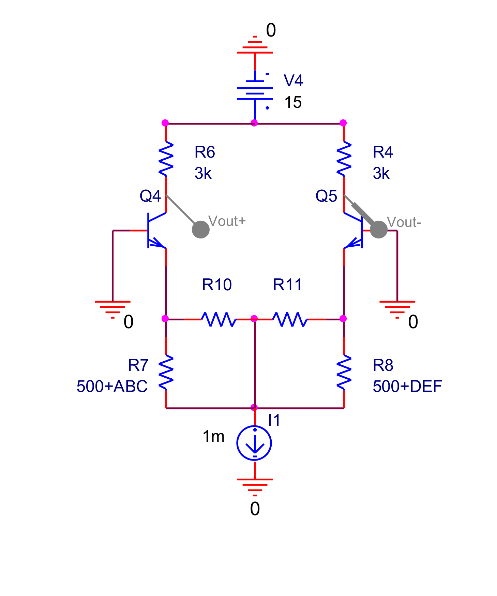{width=2.0in}
\nopagebreak[4]

\figcap{Figure 2 - Figure 3: BJT differential pair with potentiometer $R_{10}$–$R_{11}$ for offset null.}

**Analytical estimate** (with $R_{10}, R_{11}$ disconnected, $V_{BE}$ equal for both transistors):

$$\frac{I_{E4}}{I_{E5}} = \frac{R_8}{R_7} = \frac{807}{716} \approx 1.127$$

$$I_{E4} = \frac{R_8}{R_7+R_8}\times I_1 = \frac{807}{1523}\times 1\,\mathrm{mA} \approx 0.530\,\mathrm{mA}, \quad I_{E5} \approx 0.470\,\mathrm{mA}$$

$$V_{out+} = 15 - 0.530\times 3 = 13.41\,\mathrm{V}, \quad V_{out-} = 15 - 0.470\times 3 = 13.59\,\mathrm{V}$$

> **[SIMULATION NEEDED: 4.3]**
> Run a PSpice bias-point simulation of Figure 3 with $R_{10}, R_{11}$ disconnected. Record $V_{out+}$ and $V_{out-}$ (no print required).

#### 4.3.1 Potentiometer Ratio for Zero Output

For equal collector currents ($I_{C4} = I_{C5}$), the effective emitter resistance of each branch must be equal:

$$R_7 + R_{10} = R_8 + R_{11}$$
$$R_{10} - R_{11} = R_8 - R_7 = 807 - 716 = 91\,\Omega$$

For a 10 kΩ potentiometer ($R_{10}+R_{11}=10\,\mathrm{k}\Omega$):

$$R_{10} = \frac{10000 + 91}{2} = 5045.5\,\Omega, \quad R_{11} = 4954.5\,\Omega$$
$$\frac{R_{10}}{R_{10}+R_{11}} \approx 0.505 \quad (50.5\%)$$

#### 4.3.2 Simulation with Chosen Ratio

> **[SIMULATION NEEDED: 4.3.2]**
> Simulate Figure 3 with $R_{10}=5045.5\,\Omega$, $R_{11}=4954.5\,\Omega$. Confirm $V_{out+}\approx V_{out-}$ (no print required).

#### 4.3.3 10% Change in Potentiometer Ratio

If the ratio changes by 10% from the balanced point, e.g. $R_{10}/R_{pot} = 0.505 \times 1.1 = 0.556$, a small asymmetry reappears.

> **[SIMULATION NEEDED: 4.3.3]**
> Simulate with the ±10% ratio perturbation and attach a print. Record $\Delta V = V_{out+} - V_{out-}$.

\newpage

## 5. CMRR

### 5.1 Definition of CMRR and Differential Gain $A_d$

$$\mathrm{CMRR} = \left|\frac{A_d}{A_{cm}}\right| \quad \text{(dimensionless)}, \qquad \mathrm{CMRR_{dB}} = 20\log_{10}\!\left|\frac{A_d}{A_{cm}}\right| \quad \text{(dB)}$$

where $A_d = V_{out}/V_{diff}$ is the differential gain and $A_{cm} = V_{out}/V_{cm}$ is the common-mode gain.

Given $\mathrm{CMRR} = 60 + \mathrm{AB} = 60 + 21 = 81\,\mathrm{dB}$ and $A_{cm} = \dfrac{\mathrm{DEF}}{1000} = \dfrac{307}{1000} = 0.307$:

$$A_d = A_{cm}\times 10^{\mathrm{CMRR_{dB}}/20} = 0.307\times 10^{81/20} = 0.307\times 10^{4.05} \approx 0.307\times 11{,}220 \approx 3.44\times 10^{3}$$

### 5.2 Transfer Functions $A_4$ and $A_5$ ($=V_{out}/V_{in}$) for Figures 4 and 5

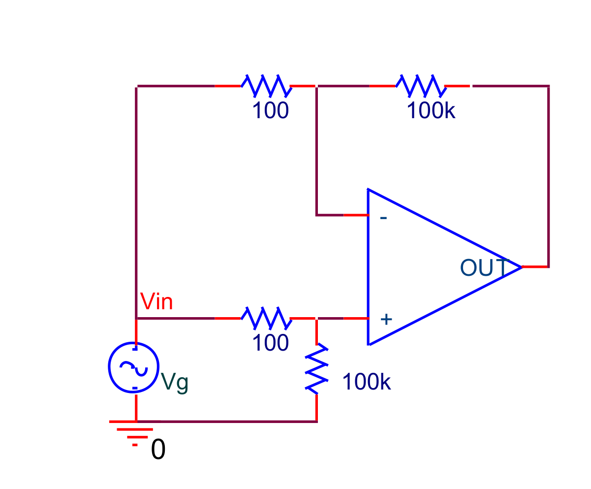{width=2.1in}
\nopagebreak[4]

\figcap{Figure 3 - Figure 4: Common-mode circuit for measuring $A_{cm}$ (ideal output $V_{out}=0$).}

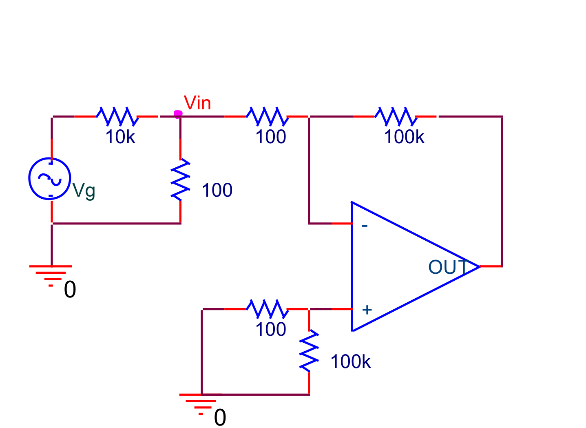{width=2.5in}
\nopagebreak[4]

\figcap{Figure 4 - Figure 5: Differential (inverting) amplifier for measuring $A_d$ ($A_5=-R_f/R_{in}=-1000$).}

**Figure 4** (common-mode circuit): both inputs are driven by the same common-mode input $V_{in}$. For an ideal op-amp with matched resistors, the common-mode signal is rejected, so

$$V_{-}=V_{in}\frac{1000}{1001}\rightarrow V_{out}=0 $$
thus:
$$A_4 = \frac{V_{out}}{V_{in}} = 0 \quad $$

A real op-amp produces a small nonzero output, so this circuit is used to measure the common-mode gain $A_{cm}$.

**Figure 5** (differential / inverting amplifier): with the signal applied differentially,

$$A_5 = \frac{V_{out}}{V_{in}} = -\frac{R_f}{R_{in}} = -\frac{100\,\mathrm{k}\Omega}{100\,\Omega} = -1000$$

This circuit measures the differential gain $A_d$.

**Circuit assignment and CMRR expression:** Figure 5 (differential, $A_5=-1000$) measures $A_d$; Figure 4 (common-mode, ideal $V_{out}=0$) measures $A_{cm}$. Hence $A_d = A_5$ and $A_{cm} = A_4$ (the small, real common-mode gain), and

$$\mathrm{CMRR} = \left|\frac{A_d}{A_{cm}}\right| = \left|\frac{A_5}{A_4}\right|$$

### 5.3 
Because the ideal common-mode output is zero, the real common-mode output $A_{cm}V_{in}$ is tiny; a large input is needed to lift it above the noise floor, so the 2–4 VRMS range (rather than 50 m–300 mVRMS) is the correct choice.

### 5.4 

Without the series input resistors the closed-loop gain would be determined by the op-amp's own (uncontrolled) input impedance rather than a known resistor ratio. The resistors define the gain precisely; without them the measurement of $A_d$ or $A_{cm}$ would be unreliable. Additionally, mismatched resistors are the dominant source of finite CMRR in a real difference amplifier; specifying exact values is essential for a quantitative CMRR measurement.

Alongside the resistor choice, the input amplitude must also be set appropriately for the differential measurement: for the differential amplification (Figure 5, $|A_5| = R_f/R_{in} = 1000$) we use an input amplitude of **50 m–300 mVRMS** (see Q5.3). This keeps the amplified output $V_{out} = A_5 V_{in}$ within the $\pm 15\,\mathrm{V}$ supply rails and the op-amp in its linear region, so that the gain, and hence the extracted CMRR, is measured accurately rather than from a clipped (distorted) waveform.

\newpage

## 6. Slew-Rate and Full-Power Bandwidth

### 6.1 Formulas and Definitions

$$\mathrm{SR} = \left.\frac{\mathrm{d}V_{out}}{\mathrm{d}t}\right|_{\max} \quad [\mathrm{V}/\mu\mathrm{s}]$$

$$\mathrm{FPBW} = \frac{\mathrm{SR}}{2\pi\, V_{om}} \quad [\mathrm{Hz}]$$

where $V_{om}$ is the maximum undistorted output amplitude (typically $V_{CC}-2\,\mathrm{V}$).

**Relationship:** FPBW is the highest frequency at which the op-amp can produce a full-swing sinusoidal output ($V_{om}$) without SR distortion. A sine wave requires $\mathrm{d}V_{out}/\mathrm{d}t|_{\max} = 2\pi f V_{om} \leq \mathrm{SR}$; at $f = \mathrm{FPBW}$ this limit is exactly reached.

### 6.2 SR vs. Finite Bandwidth

| | Slew-rate limiting | Finite (closed-loop) bandwidth |
|:---|:---|:---|
| **Effect on output** | Output ramp at constant slope $\pm$SR; triangular rather than sinusoidal | Output sinusoidal but attenuated at $f > f_{-3\mathrm{dB}}$ |
| **Depends on** | Signal amplitude and frequency | Signal frequency only (not amplitude) |
| **Electronic origin** | A compensation capacitor inside the op-amp can only charge/discharge at a finite current ($I_{bias}$); $\mathrm{SR}=I_{bias}/C$ | The single dominant pole formed by the compensation capacitor limits high-frequency open-loop gain, reducing closed-loop BW |

SR is a **large-signal** (nonlinear) phenomenon; finite BW is a **small-signal** (linear) limitation.

### 6.3 Maximum Input Amplitude Before SR Limiting (Figure 6)

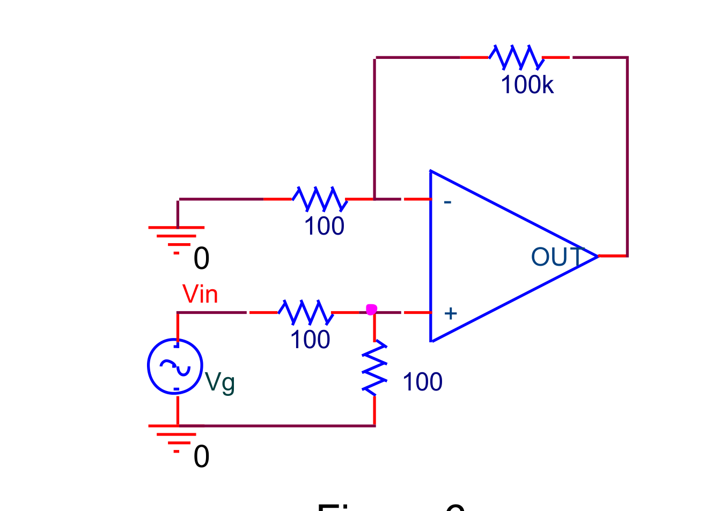{width=2.2in}
\nopagebreak[4]

\figcap{Figure 5 - Figure 6: Circuit used for slew-rate measurement ($R_{in}=100\,\Omega$, $R_f=100\,\mathrm{k}\Omega$, $|A_v|=1000$).}

For a sinusoidal input at frequency $f$, the output slope requirement is:

$$\left.\frac{\mathrm{d}V_{out}}{\mathrm{d}t}\right|_{\max} = 2\pi f\,|A_v|\,V_{in,pk}$$

Setting this equal to SR (SR-limit onset):

$$V_{in,pk}^{\max} = \frac{\mathrm{SR}}{2\pi f\,|A_v|}$$

For the LM741 simulation ($\mathrm{SR}=0.5\,\mathrm{V}/\mu\mathrm{s}$, $|A_v|=1000$, $f=1\,\mathrm{kHz}$):

$$V_{in,pk}^{\max} = \frac{0.5\times10^6}{2\pi\times10^3\times10^3} \approx 80\,\mathrm{mV_{pk}} \approx 56\,\mathrm{mVRMS}$$

### 6.4 Full-Power Bandwidth for Two Supply Voltages

$$\mathrm{FPBW} = \frac{\mathrm{SR}}{2\pi\,V_{om}}$$

For LM741, $\mathrm{SR}=0.5\,\mathrm{V}/\mu\mathrm{s}$, $V_{om}\approx V_{CC}-2\,\mathrm{V}$:

| Supply $V_{CC}$ | $V_{om}$ | FPBW |
|:---:|:---:|:---:|
| $\pm 15\,\mathrm{V}$ | $13\,\mathrm{V}$ | $\dfrac{0.5\times10^6}{2\pi\times13}\approx 6.1\,\mathrm{kHz}$ |
| $\pm 12\,\mathrm{V}$ | $10\,\mathrm{V}$ | $\dfrac{0.5\times10^6}{2\pi\times10}\approx 8.0\,\mathrm{kHz}$ |

These values are qualitative (actual op-amp unknown); they may not be achievable in the lab, but are theoretically consistent with LM741 specifications.

### 6.5 Output for Step-Function Input with Load Capacitor

With a capacitor $C_L$ at the output and an ideal step $V_{in} = V_0\,u(t)$, the output $V_{out}(t)$:

**Not SR-limited** (small $V_0$, $|A_v|V_0 < $ SR threshold): The output rises exponentially with time constant $\tau = R_{out}C_L$ (or the closed-loop time constant $1/(2\pi f_{-3\mathrm{dB}})$), approaching the final value $A_v\,V_0$.

**SR-limited** (large $V_0$): The output rises as a **linear ramp** with slope SR until it reaches the final value $A_v V_0$, then settles. The larger $V_0$, the longer the ramp phase.

Qualitative sketch:
- Non-SR-limited: smooth exponential approach to $A_v V_0$.
- SR-limited: straight ramp at slope SR, then exponential settling at the top.

### 6.6 Scope Scale for SR Observation

The LM741 SR $\approx 0.5\,\mathrm{V}/\mu\mathrm{s}$. A 10–15 V output swing (full-scale) takes:

$$t_{slew} = \frac{\Delta V}{\mathrm{SR}} = \frac{15}{0.5} = 30\,\mu\mathrm{s}$$

To see this comfortably in 10 cm (10 divisions) across the screen:

$$\text{Scale} = \frac{30\,\mu\mathrm{s}}{3\text{ div}} \approx 10\,\mu\mathrm{s/div}$$

Recommended: **10 μs/div**, allowing the rising edge to span 3–4 divisions.

### 6.7 Measuring SR in the Lab

1. Build Figure 6 with the appropriate gain.
2. Apply a **square wave** input at low frequency (e.g., 100 Hz), amplitude small enough that the output is SR-limited on the edges (check: output ramps linearly, not exponentially).
3. Set horizontal scale to ~10 μs/div so the rising/falling edges span several divisions.
4. Use the cursors to measure $\Delta V$ (vertical) and $\Delta t$ (horizontal) on the linear portion of the rising edge.
5. $\mathrm{SR} = \Delta V / \Delta t$.

Do **not** use frequency sweeping to measure SR, at higher frequencies, additional distortion mechanisms unrelated to SR appear and corrupt the measurement.

\newpage

## 7. Gain-Bandwidth Product

### 7.1 Single-Pole Transfer Function and Bode Plot

$$A(j\omega) = \frac{A_0}{1 + j\omega/\omega_p} \quad\Rightarrow\quad |A(f)| = \frac{A_0}{\sqrt{1+(f/f_p)^2}}$$

Qualitative semi-log Bode magnitude:

- Flat at $A_0$ (in dB) for $f \ll f_p$
- Decreases at $-20\,\mathrm{dB/decade}$ for $f \gg f_p$
- Crosses 0 dB at $f_t = A_0 f_p$ (unity-gain frequency)

Note that the open-loop bandwidth $f_p$ is only a few Hz, so the gain rolls off over many decades before reaching unity.

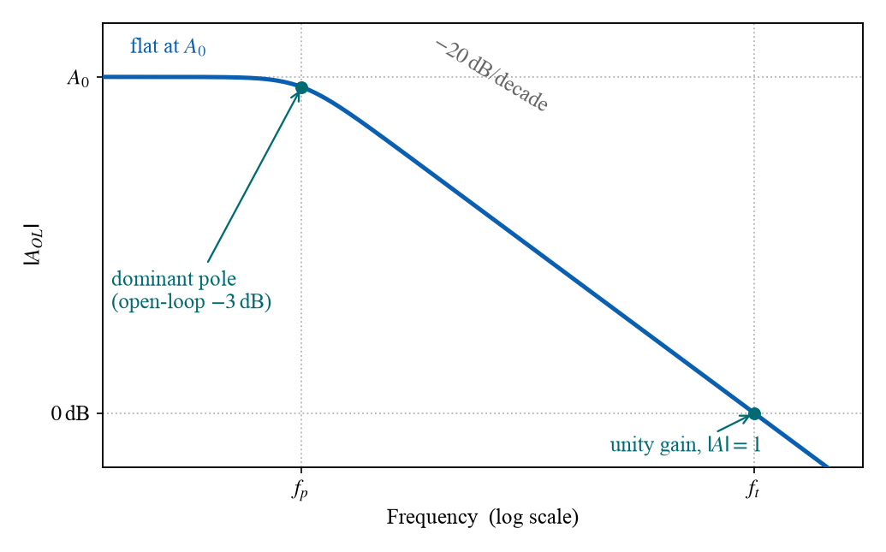
\nopagebreak[4]

\figcap{Figure 6: Qualitative single-pole open-loop magnitude, flat at $A_0$ up to the dominant pole $f_p$ (the open-loop $-3\,$dB point), then $-20\,$dB/decade, crossing $0\,$dB (unity gain) at $f_t=A_0 f_p$.}

### 7.2 Unity-Gain BW Equals GBW in Single-Pole Model

For a single-pole model, $f_t \approx A_0 f_p$ (since $f_t \gg f_p$). The GBW product of the first pole is defined as $A_0\times f_p$. Thus:

$$f_t = A_0 f_p = \mathrm{GBW}$$

For a **multi-pole** op-amp, the gain falls faster above the first pole (the second pole adds additional phase and gain roll-off), so $f_t < A_0 f_p$. Hence equality holds **if and only if** the single-pole approximation is valid.

### 7.3 Numerical Example: $A_0 = 25+\mathrm{AB} = 46\,\mathrm{dB}$, $f_p = 50+\mathrm{DE} = 80\,\mathrm{kHz}$

Using our assigned digits $\mathrm{AB}=21$ (Shai) and $\mathrm{DE}=30$ (Dan):

- **DC gain:** $A_0 = (25+\mathrm{AB})\,\mathrm{dB} = 46\,\mathrm{dB}$, i.e. $A_0 = 10^{46/20} \approx 200\ \mathrm{V/V}$
- **Pole / open-loop bandwidth** ($-3\,$dB): $f_p = (50+\mathrm{DE})\,\mathrm{kHz} = 80\,\mathrm{kHz}$
- **Bode slope:** $-20\,\mathrm{dB/decade}$ above $f_p$
- **Unity-gain bandwidth:** $f_t = A_0 f_p \approx 200\times 80\,\mathrm{kHz} \approx 16\,\mathrm{MHz}$ (equivalently $f_t = f_p\cdot 10^{46/20}$, i.e. $46/20 = 2.3$ decades above $f_p$)
- **GBW** $= f_t \approx 16\,\mathrm{MHz}$

*The required graph for this part is the single Bode plot shown after Q7.4 (Figure 7); it carries the values from both Q7.3 ($A_0$, $f_p$, $f_t$) and Q7.4 (the two marked operating points).*

### 7.4 Gain at $f = 10(50+\mathrm{DE}) = 800\,\mathrm{kHz}$ and Frequency for $|A| = 0.1(25+\mathrm{AB}) = 4.6\,\mathrm{dB}$

Above the pole the magnitude falls as $|A|_\mathrm{dB} = A_{0,\mathrm{dB}} - 20\log_{10}(f/f_p)$.

**Gain at $f = 10(50+\mathrm{DE})\,\mathrm{kHz} = 800\,\mathrm{kHz}$** (one decade above $f_p$):

$$|A(800\,\mathrm{kHz})| = 46 - 20\log_{10}\frac{800\,\mathrm{kHz}}{80\,\mathrm{kHz}} = 46 - 20 = 26\,\mathrm{dB}\quad(\approx 20\ \mathrm{V/V})$$

**Frequency where $|A| = 0.1(25+\mathrm{AB}) = 4.6\,\mathrm{dB}$:**

$$46 - 20\log_{10}\frac{f}{f_p} = 4.6 \;\Rightarrow\; \log_{10}\frac{f}{f_p} = \frac{41.4}{20} = 2.07 \;\Rightarrow\; f = 80\,\mathrm{kHz}\times 10^{2.07} \approx 9.4\,\mathrm{MHz}$$

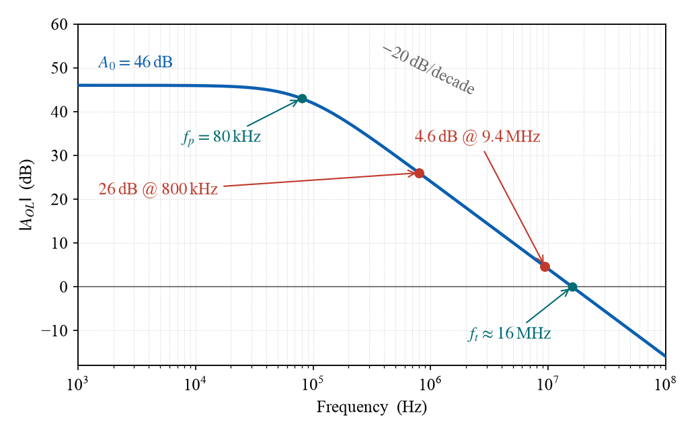
\nopagebreak[4]

\figcap{Figure 7: Open-loop magnitude for $A_0=25+\mathrm{AB}=46\,$dB and $f_p=50+\mathrm{DE}=80\,$kHz (Q7.3), with $f_t=\mathrm{GBW}\approx16\,$MHz; the red points mark the Q7.4 results $26\,$dB ($\approx20\,$V/V) at $800\,$kHz and $4.6\,$dB at $9.4\,$MHz.}

### 7.5 GBW Product for Each Circuit (Figures 7 and 8)

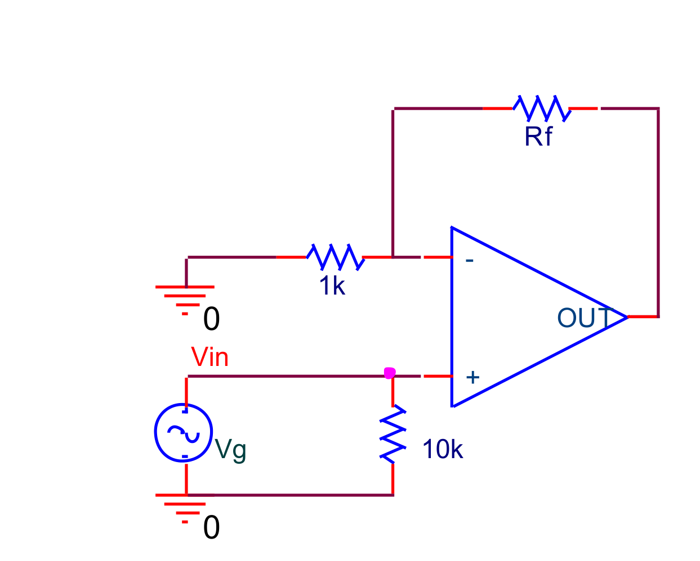{width=2.2in}
\nopagebreak[4]

\figcap{Figure 8 - Figure 7: Non-inverting amplifier for GBW measurement ($R_1=1\,\mathrm{k}\Omega$ from the $-$ input to ground, $R_2=R_f$ variable, $10\,\mathrm{k}\Omega$ in series with the $+$ input).}

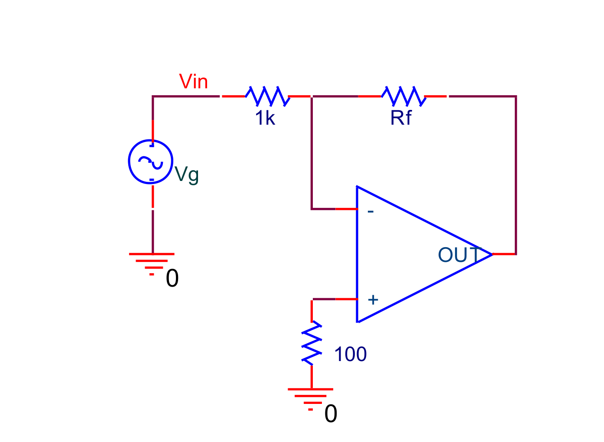{width=2.2in}
\nopagebreak[4]

\figcap{Figure 9 - Figure 8: Inverting amplifier for GBW measurement ($R_1=1\,\mathrm{k}\Omega$, $R_2=R_f$ variable, $100\,\Omega$ from the $+$ input to ground).}

We use the transfer functions **given in the procedure** (single-pole op-amp, finite open-loop gain $A_{OL}$), with $R_2 = R_f$, $R_1 = 1\,\mathrm{k}\Omega$, and $\omega_{3\mathrm{dB}} = \dfrac{\omega_t}{1+R_2/R_1}$:

**Figure 7** (non-inverting):

$$\frac{V_{out}(s)}{V_{in}(s)} = \frac{1+R_2/R_1}{\,1+\dfrac{1}{A_{OL}}\!\left(1+\dfrac{R_2}{R_1}\right)+\dfrac{s}{\omega_{3\mathrm{dB}}}\,}$$

**Figure 8** (inverting):

$$\frac{V_{out}(s)}{V_{in}(s)} = \frac{-R_2/R_1}{\,1+\dfrac{1}{A_{OL}}\!\left(1+\dfrac{R_2}{R_1}\right)+\dfrac{s}{\omega_{3\mathrm{dB}}}\,}$$

The **GBW product = (DC gain) × (bandwidth)**. From each TF the DC gain is the $s\to 0$ value and the bandwidth is $\omega_{3\mathrm{dB}}$. Writing $C \equiv 1+\dfrac{1}{A_{OL}}\!\left(1+\dfrac{R_2}{R_1}\right)$ for the (finite-$A_{OL}$) denominator constant:

$$\mathrm{GBW}_7 = \underbrace{\frac{1+R_2/R_1}{C}}_{\text{DC gain}}\cdot\,\underbrace{\frac{\omega_t}{1+R_2/R_1}}_{\omega_{3\mathrm{dB}}} = \frac{\omega_t}{C}\qquad\text{(non-inverting)}$$

$$\mathrm{GBW}_8 = \underbrace{\frac{R_2/R_1}{C}}_{\text{DC gain}}\cdot\,\underbrace{\frac{\omega_t}{1+R_2/R_1}}_{\omega_{3\mathrm{dB}}} = \frac{\omega_t}{C}\cdot\frac{R_2/R_1}{1+R_2/R_1}\qquad\text{(inverting)}$$

### 7.6 GBW for Large $A_{OL}$

When $A_{OL}$ is very large, $C = 1+\dfrac{1}{A_{OL}}\!\left(1+\dfrac{R_2}{R_1}\right)\to 1$, so:

$$\boxed{\ \mathrm{GBW}_7 \to \omega_t\ }\qquad\text{(non-inverting, Figure 7)}$$

$$\boxed{\ \mathrm{GBW}_8 \to \omega_t\cdot\frac{R_2/R_1}{1+R_2/R_1}\ }\qquad\text{(inverting, Figure 8)}$$

The non-inverting circuit's GBW equals the op-amp's own unity-gain frequency $\omega_t$ ($f_t=\omega_t/2\pi$); the inverting circuit's GBW is smaller by the factor $\dfrac{R_2/R_1}{1+R_2/R_1}$ (its DC gain is $R_2/R_1$ while its bandwidth is still set by the noise gain $1+R_2/R_1$).

### 7.7 Condition for the Two GBW to be Approximately Equal

$$\mathrm{GBW}_8 \approx \mathrm{GBW}_7 \iff \frac{R_2/R_1}{1+R_2/R_1}\to 1 \iff R_2 \gg R_1,$$

i.e. high closed-loop gain ($R_f \gg 1\,\mathrm{k}\Omega$): then the "$+1$" in the inverting circuit's noise gain is negligible and both products approach $\omega_t$.

\newpage

## 8. Open-Loop Gain

### 8.1 $V_y/V_g$ and $V_o/V_g$ for Ideal Op-Amp (Figure 9)

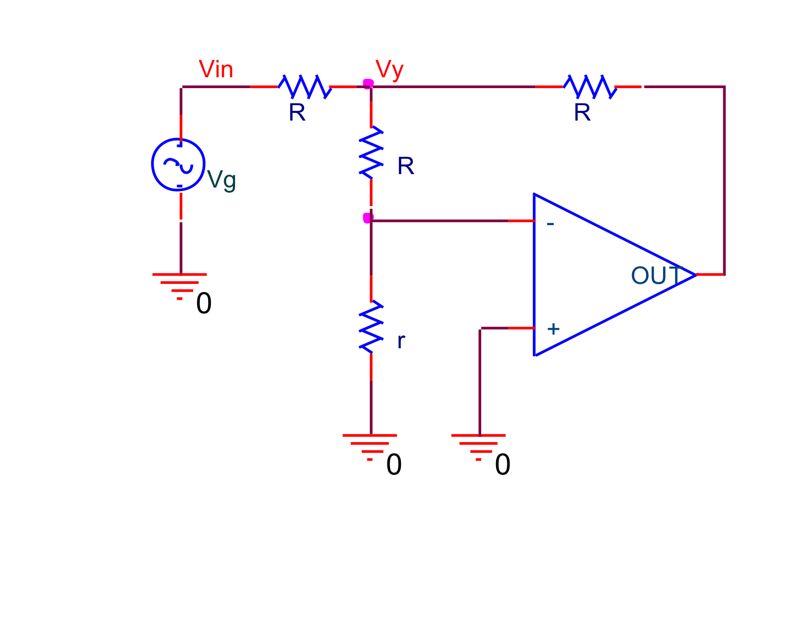{width=2.5in}
\nopagebreak[4]

\figcap{Figure 10 - Figure 9: Circuit for open-loop gain measurement, three equal resistors $R$ meet at node $V_y$ (to $V_{in}$, to $V_o$, and down to the $(-)$ input node $X$), which is tied to ground through $r$.}

In Figure 9, node $V_y$ is joined by three equal resistors $R$, to the input ($V_{in}=V_g$), to the output ($V_o$), and downward to the op-amp's $(-)$ input node $X$; node $X$ connects to ground through $r$, and the $(+)$ input is grounded.

For an **ideal** op-amp: $V^+ = 0 \Rightarrow V^- = X = 0$ (virtual ground), with no current into the input.

KCL at $X$ (with $X=0$): $\dfrac{V_y - X}{R} = \dfrac{X}{r} \Rightarrow \dfrac{V_y}{R}=0 \Rightarrow V_y = 0$.

KCL at $V_y$ (with $V_y=0,\ X=0$):
$$\frac{V_{in}-V_y}{R} + \frac{V_o-V_y}{R} + \frac{X-V_y}{R} = 0 \;\Rightarrow\; V_{in}+V_o = 0 \;\Rightarrow\; V_o = -V_{in}$$

$$\boxed{\frac{V_y}{V_g} = 0, \quad \frac{V_o}{V_g} = -1}$$

### 8.2 Non-Ideal Case: Measuring $A_{OL}$

For a **non-ideal** op-amp, $V_o = A_{OL}(V^+-V^-) = -A_{OL}X$ (input draws no current). The two KCL equations become:

- At $X$: $\dfrac{V_y-X}{R} = \dfrac{X}{r} \;\Rightarrow\; X = k\,V_y,\qquad k=\dfrac{r}{r+R}$
- At $V_y$: $V_{in}+V_o+X-3V_y = 0$

Substituting $V_o=-A_{OL}X=-A_{OL}k\,V_y$ gives $\dfrac{V_{in}}{V_y}=3-k+A_{OL}k$, i.e. (dropping the negligible $+1$ since $A_{OL}\gg1$) exactly the formula quoted in the procedure under Figure 9:

$$\boxed{\,A_{OL} = \frac{1}{k}\left(\frac{V_{in}}{V_y} - 3\right),\qquad k=\frac{r}{r+R}\,}$$

**Points to measure:** the input $V_{in}=V_g$ and the node **$V_y$**; then evaluate $A_{OL}$ from the boxed formula.

**Why $V_y$, and not the op-amp's own differential input?** The true differential input is $V^-=X=k\,V_y$, a factor $1/k$ *smaller* than $V_y$ and buried in the noise, it cannot be probed directly. $V_y$ is a real, accessible node (larger by $1/k$) that still encodes $A_{OL}$. The approximate closed-loop result $V_o/V_{in}\approx-1$ is useless here because it is essentially independent of $A_{OL}$.

**Required input signal.**

- **Shape:** Sine wave (to measure RMS values unambiguously; square wave would introduce harmonics)
- **Frequency:** Very low, of order a few Hz (e.g. $1\text{–}10\,\mathrm{Hz}$). The op-amp's open-loop bandwidth is only several Hz, so the flat (DC) value of $A_{OL}$ is reached only *below* this dominant pole; at $100\,\mathrm{Hz}$ the open-loop gain is already rolling off. In the lab the measurement is therefore swept down to $100\,\mathrm{Hz}$, $10\,\mathrm{Hz}$ and $1\,\mathrm{Hz}$ to trace the roll-off and extract the DC value.
- **Amplitude:** $V_g$ of order $100\,\mathrm{mV}$–$1\,\mathrm{V_{RMS}}$, so that $V_o = A_v\,V_g \approx -V_g$ remains within $\pm 15\,\mathrm{V}$ (not clipping), while $V_y \approx V_g/(A_{OL}k)$ stays small but above the noise floor

Expected signals: $V_{in}=V_g$ and $V_o \approx -V_g$ (large, clean sines); $V_y \approx V_g/(A_{OL}k)$ (very small, near the noise floor, noisy).

**Scope functions for measuring the small signal $V_y$** (when $V_y$ is at the measurement-noise level).

- **Averaging:** The scope averages $N$ consecutive acquisitions; random noise decreases by $\sqrt{N}$ while the coherent (periodic) $V_y$ signal is preserved. Essential when $V_y$ is at the noise floor.
- **BW Limit:** Limits the oscilloscope's measurement bandwidth (e.g., to 20 kHz), cutting broadband noise that is irrelevant for a low-frequency measurement.
- **Fine:** Allows fine adjustment of the vertical scale (e.g., mV/div resolution), maximising the on-screen amplitude of $V_y$ for more precise cursor measurements.

\newpage

## 9. Op-Amp as an Integrator

### 9.1 Transfer Function, Poles/Zeros, Canonical Form, Dominant Pole

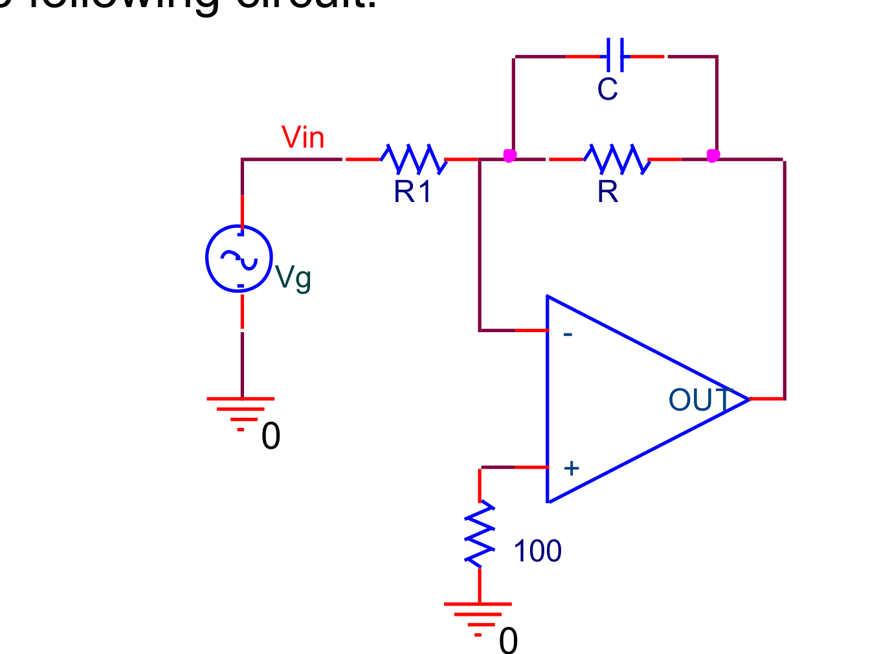{width=2.2in}
\nopagebreak[4]

\figcap{Figure 11 - Figure 10: Integrator circuit, input resistor $R_1$, feedback resistor $R$ in parallel with $C$, and $100\,\Omega$ on the $+$ input.}

For an **ideal** op-amp the inverting input is a virtual ground, so the feedback impedance $Z_f = R \,\|\, \dfrac{1}{j\omega C} = \dfrac{R}{1+j\omega R C}$ sets the (inverting) transfer function:

$$H(j\omega) = \frac{V_{out}}{V_{in}} = -\frac{Z_f}{R_1} = -\frac{R}{R_1}\cdot\frac{1}{1+j\omega R C}.$$

**Poles and zeros:** one pole, no finite zeros.

**Canonical form** (in the requested $H(s)=H_0\dfrac{\prod(\omega_z+s)}{\prod(\omega_p+s)}$ form, here with no zeros and one pole):

$$H(s) = -\frac{R}{R_1}\cdot\frac{\omega_p}{s+\omega_p}\;=\;\frac{H_0}{s+\omega_p},\quad H_0 = -\frac{R}{R_1}\,\omega_p \;\;\equiv\;\; H(j\omega)=-\frac{R/R_1}{1+j\omega/\omega_p}.$$

**Dominant pole:**

$$\omega_p = \frac{1}{R C}\qquad\Longleftrightarrow\qquad f_p = \frac{\omega_p}{2\pi} = \frac{1}{2\pi R C}.$$

### 9.2 Low- and High-Frequency Approximations

$$H(\omega \ll \omega_p) \approx -\frac{R}{R_1}\quad\text{(real, frequency-independent: an \textbf{inverting amplifier} of gain }-R/R_1),$$

$$H(\omega \gg \omega_p) \approx -\frac{R}{R_1}\cdot\frac{\omega_p}{j\omega} = -\frac{1}{j\omega R_1 C}\quad\text{(an \textbf{ideal integrator}).}$$

#### 9.2.1 Square Wave at $\omega \ll \omega_p$

The circuit is an inverting amplifier of gain $-R/R_1$: the output is the **input square wave, inverted and scaled by $R/R_1$**, same square shape, no integration. **Action:** (inverting) amplification.

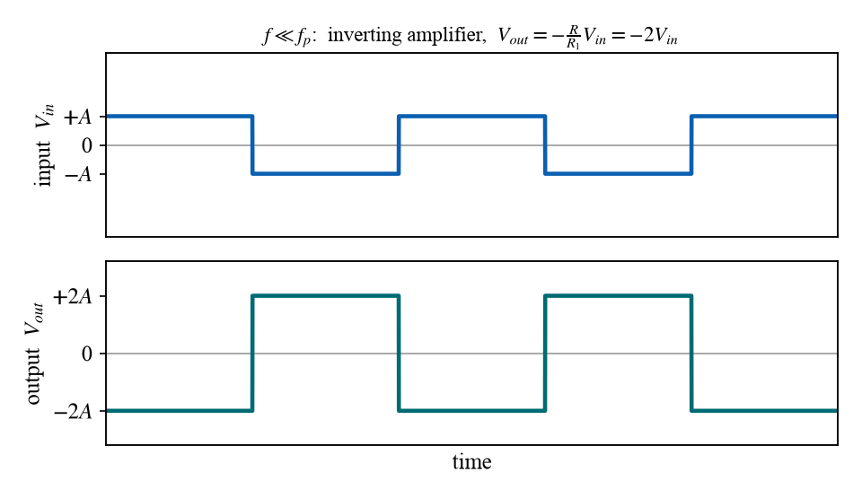{width=4.0in}
\nopagebreak[4]

\figcap{Figure 12: $\omega \ll \omega_p$, the output is a square wave, inverted and amplified by $R/R_1 = 2$ relative to the input.}

#### 9.2.2 Square Wave at $\omega \gg \omega_p$

The circuit is an ideal integrator: the integral of a square wave is a **triangular wave**. Because the integrator inverts, the output ramps **down** while the input is high and **up** while it is low, so it is $90^\circ$ out of phase with the input, with amplitude $\propto 1/\omega$. **Action:** integration.

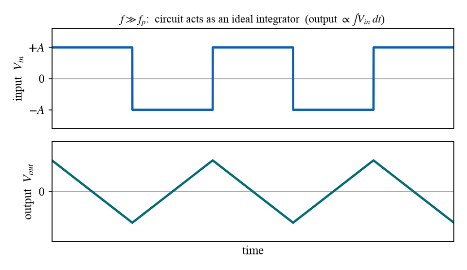{width=4.0in}
\nopagebreak[4]

\figcap{Figure 13: $\omega \gg \omega_p$, the output is a triangular wave (the integral of the square input), $90^\circ$ shifted and with amplitude $\propto 1/\omega$.}

### 9.3 Simulation: Bode Plot and $f_p$ ($R_1=10\,\mathrm{k}\Omega$, $C=10\,\mathrm{nF}$, $R=20\,\mathrm{k}\Omega$)

Substituting the values introduced in this section, the low-frequency gain and dominant pole are predicted to be

$$\left|\frac{R}{R_1}\right| = \frac{20\,\mathrm{k}\Omega}{10\,\mathrm{k}\Omega} = 2 = 20\log_{10}2 \approx 6.0\,\mathrm{dB},\qquad f_p = \frac{1}{2\pi R C} = \frac{1}{2\pi(20\times10^3)(10\times10^{-9})} \approx 796\,\mathrm{Hz}.$$

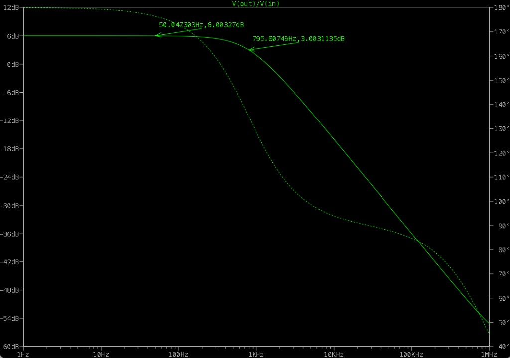
\nopagebreak[4]

\figcap{Figure 14: Simulated Bode plot of Figure 10 ($V_{out}/V_{in}$). Flat magnitude $\approx 6.0\,$dB ($=R/R_1=2$); the cursor at $795.8\,$Hz reads $3.00\,$dB, exactly $3\,$dB below the flat level.}

The simulation matches the analysis: the magnitude is flat at $6.00\,\mathrm{dB}$ (gain $=2=R/R_1$, confirming the low-frequency inverting-amplifier behaviour of Q9.2) and rolls off at $-20\,\mathrm{dB/decade}$ above the corner. Reading the corner of the roll-off gives

$$\boxed{\,f_p \approx 795.8\,\mathrm{Hz}\,}$$

in excellent agreement with the theoretical $796\,\mathrm{Hz}$ (error $<0.1\%$). The phase (dotted) starts at $180^\circ$ (pure inversion at low $f$) and falls toward $90^\circ$ at high $f$ (integrator), passing $\approx135^\circ$ near $f_p$.

### 9.4 −3 dB Frequency from the Simulation

The $-3\,\mathrm{dB}$ frequency is where the magnitude has dropped $3\,\mathrm{dB}$ below its flat value, i.e. to $6.00-3.00 = 3.00\,\mathrm{dB}$. The simulation cursor reads exactly this level at

$$\boxed{\,f_{-3\mathrm{dB}} \approx 795.8\,\mathrm{Hz}\,}$$

Since the response is **single-pole**, the $-3\,\mathrm{dB}$ frequency coincides with the dominant pole, $f_{-3\mathrm{dB}} = f_p \approx 795.8\,\mathrm{Hz} \approx 1/(2\pi RC)$.

\newpage

## 10. Op-Amp as a Summation Circuit

### 10.1 Output of the Example Circuit and Its Operation (Figure 11)

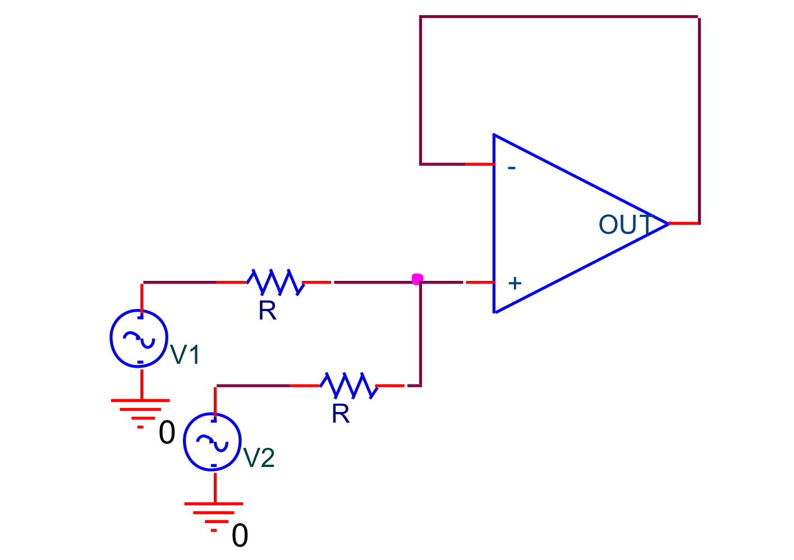{width=2.3in}
\nopagebreak[4]

\figcap{Figure 15 - Figure 11: Example "summation" circuit. Both sources drive the non-inverting ($+$) input through equal resistors $R$, while the inverting ($-$) input is wired directly to the output.}

This circuit is **not** an inverting summer: there is no feedback resistor, both inputs feed the **non-inverting** ($+$) input through equal resistors $R$, and the $(-)$ input is tied directly to the output. For an ideal op-amp the direct feedback gives $V^- = V_{out}$, and the virtual short gives $V^+ = V^- = V_{out}$. At the $(+)$ node no current enters the op-amp, so KCL through the two equal resistors is

$$\frac{V_1 - V^+}{R} + \frac{V_2 - V^+}{R} = 0 \;\Rightarrow\; V^+ = \frac{V_1+V_2}{2}.$$

Therefore

$$\boxed{V_{out} = \frac{V_1 + V_2}{2}.}$$

**Mathematical operation:** the circuit computes the **(non-inverting) average** of the two inputs, i.e. half their sum.

### 10.2 Assigned Function from $F$ and $L$

Both digits are taken from Shai Livshits' ID ($208632216$):

- $F$ = **first digit** $\Rightarrow F = 2$ (**even**)
- $L$ = **last digit** $\Rightarrow L = 6$ (**even**)

From the table, the **F-even / L-even** column assigns the function (with the feedback resistor fixed at $R_f = 10\,\mathrm{k}\Omega$):

$$\boxed{V_{out} = -2\,V_1 + 2\,V_2}\qquad (R_f = 10\,\mathrm{k}\Omega)$$

### 10.3 Circuit Design from the Master Circuit (Figure 12)

We reasoned our way to the implementation in three steps. *(We use the same resistor names as the simulation schematic in 10.4: $R_{in1}$ for $V_1$'s input resistor, $R_{in2}$ for $V_2$'s, $R_f$ for the feedback, and $R_g$ from the $(+)$ input to ground.)*

**Step 1, choosing which input each source drives.** Our assigned function is $V_{out} = -2V_1 + 2V_2$. The coefficient of $V_1$ is **negative**, so $V_1$ has to enter through the **inverting** $(-)$ input; the coefficient of $V_2$ is **positive**, so $V_2$ has to enter through the **non-inverting** $(+)$ input. The two magnitudes are equal ($2$), which is precisely the behaviour of a one-op-amp **difference amplifier**, $V_{out} = \frac{R_f}{R_{in1}}(V_2 - V_1)$. Recognising this lets us read the design directly off the master circuit instead of solving the general case.

**Step 2, sizing the resistors for the gain ratio.** On the inverting path the gain magnitude is $R_f/R_{in1}$, and we need it to be $2$. The procedure fixes the feedback resistor at $R_f = 10\,\mathrm{k}\Omega$, so we are forced to take

$$R_{in1} = \frac{R_f}{2} = 5\,\mathrm{k}\Omega.$$

**Step 3, balancing the non-inverting path.** The clean result $V_{out} = \frac{R_f}{R_{in1}}(V_2 - V_1)$ holds only if the two branches are matched, i.e. $R_{in2} = R_{in1}$ (so $V_2$'s series resistor equals $V_1$'s) and $R_g = R_f$ (the $(+)$-to-ground resistor equals the feedback). With that match the non-inverting gain $\left(1+\frac{R_f}{R_{in1}}\right)\frac{R_g}{R_{in2}+R_g}$ also comes out to exactly $2$, so it cancels $V_1$ and $V_2$ with equal weight. This forces $R_{in2} = R_{in1} = 5\,\mathrm{k}\Omega$ and $R_g = R_f = 10\,\mathrm{k}\Omega$. Our chosen values are therefore

$$\boxed{R_f = R_g = 10\,\mathrm{k}\Omega,\qquad R_{in1} = R_{in2} = 5\,\mathrm{k}\Omega}\qquad (4\ \text{resistors}).$$

Substituting back confirms the full transfer function: $V_{out} = \left(1+\dfrac{R_f}{R_{in1}}\right)\dfrac{R_g}{R_{in2}+R_g}V_2 - \dfrac{R_f}{R_{in1}}V_1 = 3\cdot\dfrac{10}{15}V_2 - 2V_1 = 2V_2 - 2V_1$, as required.

All four values are free resistors on the board ($10\,\mathrm{k}\Omega$: R5 / R9 / R18; $5\,\mathrm{k}\Omega$: R6 / R11 / R19), so our design uses only available board resistors and stays within the "$\leq 4$ resistors" hint. Mapping onto the master circuit (Figure 12): $V_1$ enters the $(-)$ input through $R_{in1}=5\,\mathrm{k}\Omega$, $V_2$ enters the $(+)$ input through $R_{in2}=5\,\mathrm{k}\Omega$, the $R_f=10\,\mathrm{k}\Omega$ feedback resistor runs from the output back to $(-)$, the $(+)$ input is tied to ground through $R_g=10\,\mathrm{k}\Omega$, and the remaining free nodes/resistors are left disconnected.

### 10.4 Simulation of the Designed Circuit

The designed difference amplifier was simulated in LTspice with the board values $R_{in1}=R_{in2}=5\,\mathrm{k}\Omega$, $R_f=R_g=10\,\mathrm{k}\Omega$ and $\pm15\,\mathrm{V}$ rails. The square-wave source $V_g$ (a $\pm1\,\mathrm{V}$, $0.4\,\mathrm{ms}$-period = $2.5\,\mathrm{kHz}$ pulse) is applied directly as $V_{in1}$, while $V_{in2}$ is taken from the on-board integrator of Q9 (R$=20\,\mathrm{k}\Omega$, $C=10\,\mathrm{nF}$, $R_1=10\,\mathrm{k}\Omega$) driven by the same $V_g$. Since $2.5\,\mathrm{kHz}\gg f_p\approx796\,\mathrm{Hz}$, the integrator operates above its pole and converts the square wave into the triangular $V_{in2}$, two inputs of essentially equal amplitude, as required.

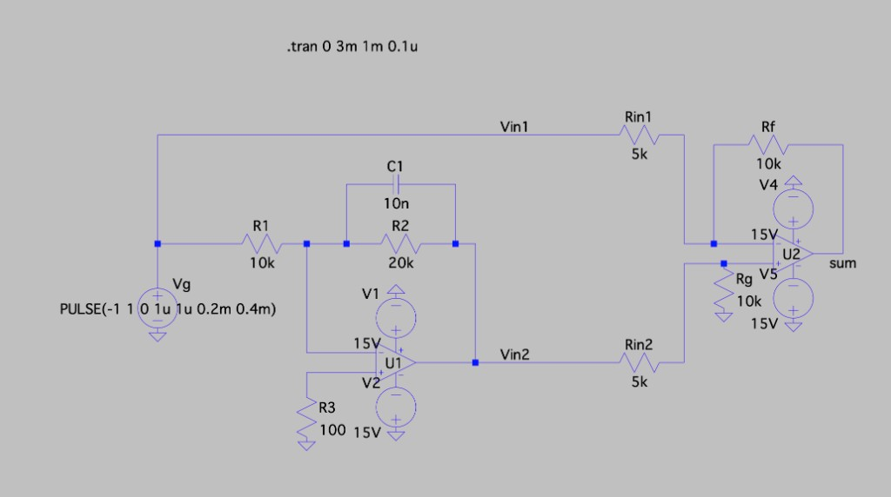
\nopagebreak[4]

\figcap{Figure 16: Simulated circuit, the integrator (left, generating triangular $V_{in2}$) feeding the designed difference amplifier $U_2$ ($R_{in1}=R_{in2}=5\,\mathrm{k}\Omega$, $R_f=R_g=10\,\mathrm{k}\Omega$).}

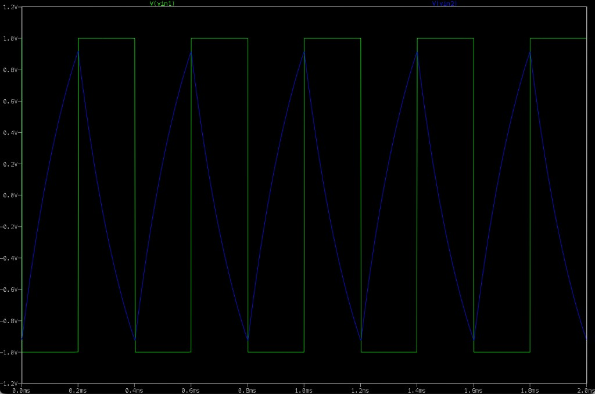
\nopagebreak[4]

\figcap{Figure 17: The two inputs of equal amplitude, $V_{in1}$ (green, $\pm1\,\mathrm{V}$ square wave) and $V_{in2}$ (blue, $\approx\pm0.9\,\mathrm{V}$ triangular integrator output).}

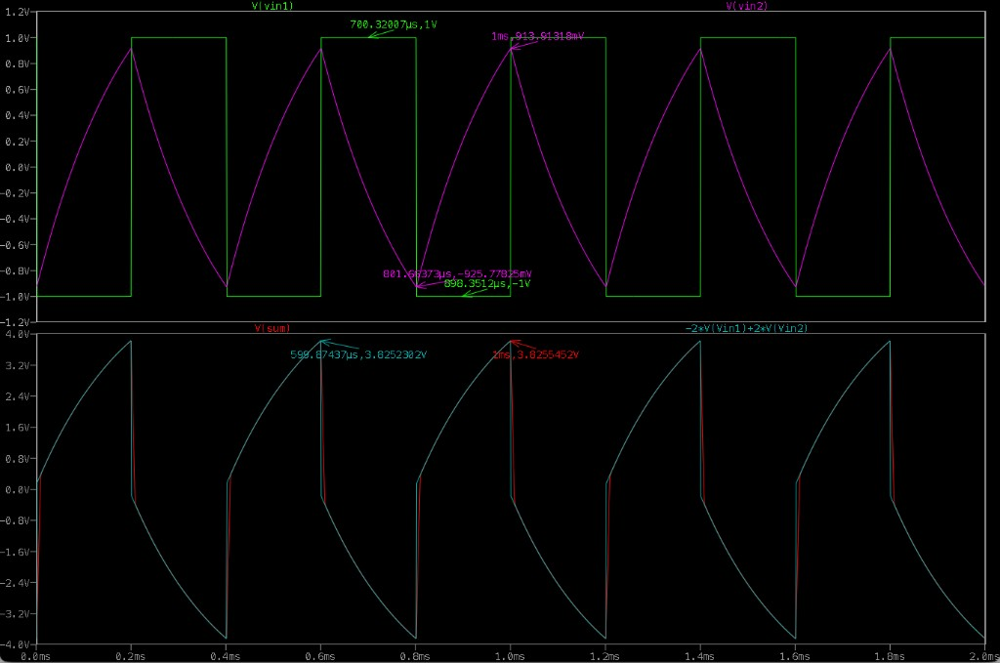
\nopagebreak[4]

\figcap{Figure 18: Top, inputs $V_{in1}$ (green, $\pm1\,$V) and $V_{in2}$ (magenta, peaks $+914\,$mV / $-926\,$mV). Bottom, output $V(\mathrm{sum})$ (red, $+3.826\,$V cursor) overlaid with the target $-2\,V_{in1}+2\,V_{in2}$ (cyan, $+3.825\,$V); the two traces coincide.}

**Result:** The cursors in Figure 18 verify both the equal-amplitude inputs and the transfer function:

- **Inputs:** $V_{in1}=+1.00\,\mathrm{V}$ / $-1.00\,\mathrm{V}$ (cursors at $700\,\mu\mathrm{s}$ and $898\,\mu\mathrm{s}$); $V_{in2}=+914\,\mathrm{mV}$ / $-926\,\mathrm{mV}$ (cursors at $1\,\mathrm{ms}$ and $802\,\mu\mathrm{s}$), i.e. essentially equal amplitudes ($\approx2\,\mathrm{V_{pp}}$ vs $\approx1.84\,\mathrm{V_{pp}}$).
- **Output:** at the positive peak ($t=1\,\mathrm{ms}$, where $V_{in1}=-1\,\mathrm{V}$, $V_{in2}=+914\,\mathrm{mV}$) the measured $V(\mathrm{sum})=+3.826\,\mathrm{V}$, while the reference trace $-2\,V_{in1}+2\,V_{in2}$ reads $+3.825\,\mathrm{V}$, agreement to $\sim0.3\,\mathrm{mV}$. The hand-check matches: $-2(-1)+2(0.914)=+3.83\,\mathrm{V}$.

Across a full cycle the output ramps between $\approx\pm3.8\,\mathrm{V}$ (each square-wave edge giving a $\Delta V_{out}=\mp4\,\mathrm{V}$ jump from the $-2\,\Delta V_{in1}$ term). The red $V(\mathrm{sum})$ trace lying on top of the cyan $-2\,V_{in1}+2\,V_{in2}$ reference confirms $V_{out}=-2V_{in1}+2V_{in2}=2(V_{in2}-V_{in1})$.

\newpage

## 11. 3 dB Frequency Measurement

### 11.1 Horizontal Scale for the SWEEP-Mode Measurement

In SWEEP mode the horizontal axis is **time**, and the generator sweeps the frequency **linearly** with time. The 3 dB-frequency formula

$$f_{-3\mathrm{dB}} = f_\text{start} + \frac{\Delta t}{T_\text{sweep}}\,f_\text{sweep}$$

converts a measured time interval $\Delta t$ into a frequency, and this conversion is valid **only because frequency and horizontal position (time) are linearly related** in the sweep. We must therefore use a **linear horizontal (time) scale**, not a logarithmic one, so that equal horizontal distances correspond to equal frequency increments. In practice the scale is set so the full sweep $T_\text{sweep}$ spans the 10-division screen (e.g. $T_\text{sweep}=1\,$s $\to 100\,$ms/div), placing both the flat region and the 3 dB crossing on screen so $\Delta t$ can be read directly with the cursors.

### 11.2 Relationship Between $V_{pp}$ at Low Frequency and Amplitude at 3 dB (LPF)

In the flat (low-frequency) region of an LPF, the output peak-to-peak amplitude is $V_{pp} = 2A_\text{flat}$.

At the $-3\,\mathrm{dB}$ frequency, the amplitude drops by $1/\sqrt{2}$:

$$V_{-3\mathrm{dB}} = \frac{A_\text{flat}}{\sqrt{2}} = \frac{V_{pp}}{2\sqrt{2}} \approx 0.354\, V_{pp}$$

Equivalently, $V_{pp}$ at 3 dB equals $V_{pp,\text{flat}}/\sqrt{2}$.

### 11.3 First Step: Identify the Frequency-Response Shape

Before measuring anything quantitatively, we perform an **AC sweep** to see the overall shape of the circuit's frequency response. We then compare that shape with our preliminary analysis: we determine whether the response is **low-pass, band-pass or high-pass**, check that it agrees with what we predicted for the circuit, and confirm the circuit is working correctly (a response that matches none of the expected filter shapes usually indicates it is wired incorrectly). Only once the shape is understood and consistent with the prelab do we go on to measure the 3 dB frequency.

*Sections 11.4–11.13 of the procedure are explanatory instructions for the lab's measurement method and require no answers; the next question is 11.14.*

### 11.14 Measuring the 3 dB Frequency When the Sweep Resembles an HPF

If the AC sweep shows a **high-pass** shape (small output at low $f$, flat at high $f$), the flat reference region is at the **high-frequency** end, so we characterise it there first and then sweep the frequency **downward**:

1. **Find the flat (high-frequency) region** and measure the input and output in **RMS**; the flat gain is $A_\text{flat} = V_{out}/V_{in}$. (Keep the high end below the lab's $4\,\mathrm{MHz}$ limit so the lumped-element model still holds.)
2. **Compute the target level** $A_{-3\mathrm{dB}} = A_\text{flat}/\sqrt{2}$ (a drop of $3\,$dB from the flat gain).
3. **Lower the frequency** from the flat region while continuously monitoring the ratio $V_{out,\text{RMS}}/V_{in,\text{RMS}}$; it stays roughly constant in the flat band, then falls as the corner is approached.
4. **Record $f_{-3\mathrm{dB}}$** as the frequency at which the ratio reaches $A_{-3\mathrm{dB}}$.

**What to be careful with:**

- Measure the **input as well**, not just the output: the 3 dB point is defined on the *transfer function* $V_{out}/V_{in}$, and the source amplitude may drift with frequency.
- Use **RMS** readings, since noise spikes corrupt a $V_{pp}$ measurement.
- As the frequency drops the period grows, so keep at least **5 full cycles** on screen with good resolution; do not go needlessly low.
- Keep the circuit **linear**: the output must stay an **undistorted sine**, otherwise reduce the input amplitude before recording.

\newpage

## 12. Table Measurement: Frequency Dependence

No questions are asked in this part of the procedure; it is purely informative, explaining the table-measurement method used during the lab. No answers are required here.
